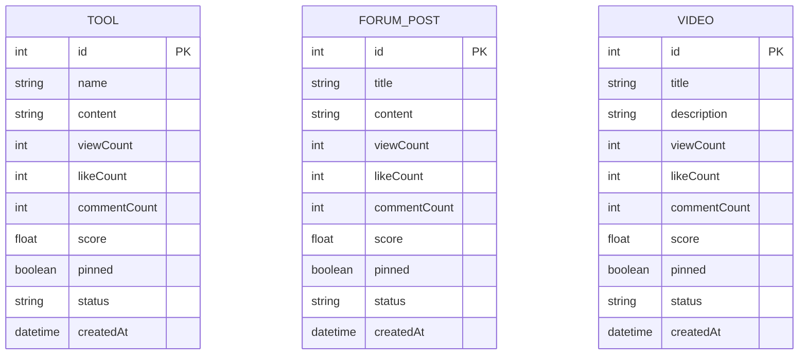
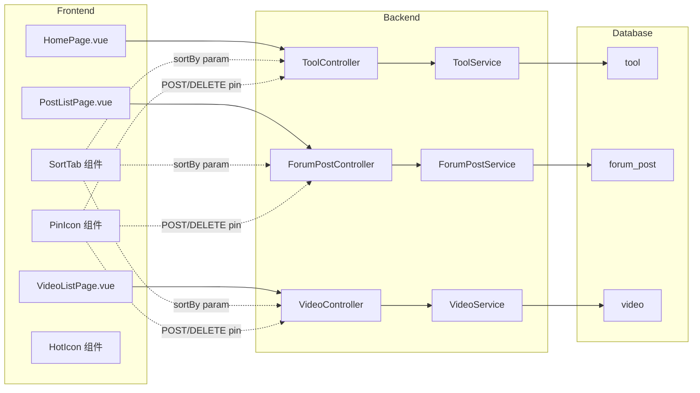

## 背景（Context）

CodingHub 三个内容模块（工具、论坛、微课）目前仅支持按创建时间排序，无置顶机制。Tool 和 ForumPost 已有 `score` 字段（`viewCount×1 + likeCount×3 + commentCount×5`），但仅用于 OverviewPage 排行榜，未接入列表排序。Video 实体缺少 `score` 字段。

**约束：**
- 后端分层：Controller → Service → Repository → Model，禁止循环依赖
- 前端纯 CSS + CSS 变量双主题，无 Tailwind
- JWT 认证 + ADMIN/SUPER_ADMIN 权限控制
- 分页响应格式不统一：Tool/Video 用自定义 `PageResponse<T>`（`ApiResponse` 包装），Forum 用原始 Spring Data `Page<T>`

## 目标 / 非目标（Goals / Non-Goals）

**目标：**
- 三模块统一支持"热度"和"最新"两种排序方式
- 三模块统一支持管理员置顶/取消置顶
- 热度排序时置顶项优先，再按 score 降序
- 最新排序时纯按创建时间降序，忽略置顶
- 全局热度前5显示火苗图标，置顶项显示向上箭头图标
- 前端提供"热度 | 最新"Tab 切换

**非目标：**
- 不做分类维度的热度排序（仅全局排序）
- 不做用户自定义排序权重
- 不改变现有分页响应格式（保持 Tool/Video 用 PageResponse，Forum 用 Spring Page）
- 不做热门/推荐等算法推荐

## 决策（Decisions）

### D1: 热度排序使用 pinned + score 复合排序

**选择：** 在 Repository 层使用 JPQL `ORDER BY pinned DESC, score DESC` 实现复合排序。

**备选：**
- A) Service 层先查 pinned 列表再查非 pinned 列表，Java 合并 → 分页复杂，性能差
- B) 数据库视图或存储过程 → 增加维护成本，不符合项目风格

**理由：** JPQL 复合排序最简洁，数据库索引可直接优化，与现有 Repository 模式一致。

### D2: 热度前5通过独立轻量接口提供

**选择：** 每个模块新增 `GET /{module}/hot-top5` 返回 `List<Long>`（5个 ID）。

**备选：**
- A) 在列表 DTO 中附带 globalRank 字段 → 需要窗口函数或额外查询，增加列表查询复杂度
- B) 复用 OverviewService 的排名接口 → 该接口返回 top 10 且格式不匹配，耦合度高

**理由：** 独立接口最轻量，前端可缓存（变更频率低），列表查询零改动。

### D3: 置顶操作使用 RESTful 端点

**选择：**
- `POST /api/v1/tools/{id}/pin` → 置顶
- `DELETE /api/v1/tools/{id}/pin` → 取消置顶
- 论坛和微课同理

**备选：**
- A) `PUT /{id}` 带 `pinned` 字段 → 需要传完整实体，不符合项目现有 API 风格
- B) `PATCH /{id}/pinned` → Spring Boot 项目未使用 PATCH 模式

**理由：** POST/DELETE 语义清晰，与项目现有的 `POST /{id}/like` 等模式一致。

### D4: Video 补全 score 字段

**选择：** 给 Video 实体添加与 Tool/ForumPost 相同的 `score` 字段和 `updateScore()` 方法，在 `incrementViewCount()`/`incrementLikeCount()` 等方法中自动调用。

**备选：** 用 viewCount 代替 score 排序 → 无法综合反映互动质量，与其他模块不一致

**理由：** 三模块统一公式，用户体验一致。

### D5: 前端排序 Tab 使用组件内状态

**选择：** 排序状态 `sortBy` 作为各列表页组件的 `ref`，不存入 Pinia store。切换时重新请求列表接口。

**备选：** 存入 Pinia store → 过度状态管理，排序是页面级 UI 状态

**理由：** 简单直接，与现有 Tool 列表页的 sortBy 模式一致。

## 数据模型



## 流程图

```mermaid
flowchart TD
    A[用户进入列表页] --> B{默认排序: 热度}
    B --> C[GET /api/v1/tools?sortBy=hot]
    C --> D[后端: ORDER BY pinned DESC, score DESC]
    D --> E[前端渲染列表]
    E --> F{同时请求 top5}
    F --> G[GET /api/v1/tools/hot-top5]
    G --> H[缓存 top5Ids Set]
    H --> I{渲染卡片}
    I --> J{item.pinned?}
    J -->|是| K[显示📌置顶图标]
    J -->|否| L[无置顶图标]
    K --> M{top5Ids.has item.id ?}
    L --> M
    M -->|是| N[显示🔥火苗图标]
    M -->|否| O[无火苗图标]
    N --> P[渲染卡片完成]
    O --> P
    E --> Q{用户切换"最新"}
    Q --> R[GET /api/v1/tools?sortBy=latest]
    R --> S[后端: ORDER BY createdAt DESC]
    S --> T[前端渲染: 无置顶/火苗图标]
```

## 架构图



## 风险 / 权衡（Risks / Trade-offs）

- **[性能] 热度排序全表排序** → score 字段已有索引（Tool/ForumPost），Video 补建索引。pinned 字段基数低（绝大多数为 false），复合索引 `(pinned DESC, score DESC)` 可有效优化
- **[一致性] top5 缓存可能短暂过期** → 置顶/取消置顶/新的互动后 top5 可能变化。前端每次进入列表页重新请求 top5，延迟可接受
- **[分页] 置顶项跨页问题** → 热度排序时置顶项固定在前，如果置顶数 > 页大小则全部置顶项占满首页。实际上置顶项不会很多（管理员手动操作），风险极低
- **[兼容性] 现有排序参数语义变更** → Tool 列表页原有 `sortBy=latest` 保持不变，新增 `sortBy=hot` 作为默认值。Forum/Video 无现有排序参数，纯新增

## 迁移计划（Migration Plan）

1. **数据库迁移**：V3 SQL 脚本添加 `pinned` 列（三表）+ `score` 列（video 表）+ 索引
2. **后端部署**：先停后端 → 跑迁移 → 启动新后端。无数据回填需求（pinned 默认 false，video.score 默认 null，访问时自动计算）
3. **前端部署**：新前端构建替换旧 dist，Nginx 无配置变更
4. **回滚**：数据库 migration 可逆（DROP COLUMN），后端/前端可回退到上一版本

## 待定问题（Open Questions）

（无）
