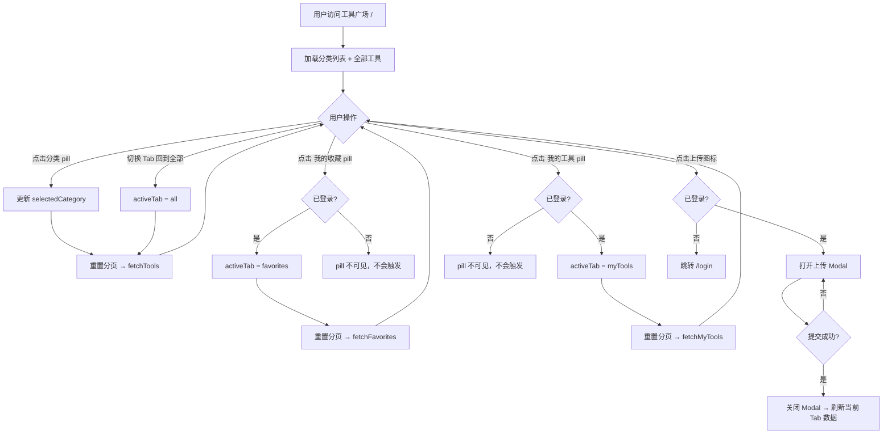

## 背景（Context）

工具广场页面（`HomePage.vue`）当前采用侧边栏 + 分类 pills 双层导航结构。用户通过 `GeneralizedSidebar` 在三个独立页面（工具列表 `/`、我的工具 `/me/tools`、我的收藏 `/me/favorites`）之间切换，每个页面各自请求不同 API、维护独立状态。这种结构导致页面层级深、工具卡片展示宽度受限、三个页面之间存在大量重复代码。

相关方：工具广场所有用户（浏览者 + 工具作者 + 管理员）。

约束：仅修改工具相关前端页面，后端 API 无变更；论坛和微课页面不在本次范围内。

## 目标 / 非目标（Goals / Non-Goals）

**目标：**

- 移除工具广场页面的左侧侧边栏，工具卡片网格改为全宽展示
- 将「我的收藏」「我的工具」合并为分类 pills 行右侧的 Tab pill，与分类筛选同行展示
- 在 pill 行最右侧增加上传工具图标按钮，点击弹出 Modal（复用 UploadPage 的表单和样式）
- 单页面内 Tab 切换，不刷新页面，仅切换数据源
- 未登录用户不展示「我的收藏」和「我的工具」pill，但展示上传图标
- 移除 AppHeader 中的「我的工具」导航按钮和下拉菜单项
- 删除不再使用的路由和页面组件

**非目标：**

- 不修改后端 API
- 不修改论坛（Forum）和微课（Video）页面的导航结构
- 不修改工具详情页（DetailPage）和编辑页（EditToolPage）
- 不修改 GeneralizedSidebar 组件本身（论坛/微课仍在使用）

## 决策（Decisions）

### 决策 1：单页面 Tab 切换 vs 路由链接

**选择：** 单页面 Tab 切换（方案 A）

在 `HomePage.vue` 内部用 `activeTab` ref 控制当前视图，切换时重置分页和分类筛选、调用对应 API，不触发路由变更。

**备选方案：** Tab 作为 router-link（方案 B）— 复用现有三个页面，只把 sidebar 替换为 tab 组件。代码改动更小，但页面切换会触发完整组件重新挂载，体验不流畅。

**理由：** 用户明确要求「不刷新页面，只刷新数据」；三个页面的卡片展示逻辑高度相似，合并到单页面可以消除重复代码。

### 决策 2：Pill 布局 — 单行混合排列

**选择：** 方案 ① — 单行排列，分类 pills 在左，个人 Tab pills 在右

```
[🔍搜索]
[●全部][聊天][写作][编程]...          [我的收藏][我的工具]  [⬆]
```

**备选方案：** 两行排列（个人维度在上，分类维度在下）— 语义更清晰但占用更多垂直空间。

**理由：** 用户选择单行方案，filter bar 已有 `flex-wrap: wrap`，在窄屏下自然换行。个人 pills 通过 `margin-left: auto` 推到右侧。

### 决策 3：上传入口 — Modal 弹窗

**选择：** 点击上传图标弹出 Modal，复用 `UploadPage.vue` 的表单结构和样式。

**备选方案：** 跳转到独立的 `/tools/upload` 页面 — 会离开当前工具列表上下文，回来后列表状态丢失。

**理由：** 用户明确要求弹窗。Modal 内复用相同的表单逻辑（name、category、version、content、file upload），提交成功后关闭弹窗并刷新当前 Tab 的数据，保持上下文不丢失。

### 决策 4：未登录用户的上传按钮行为

**选择：** 未登录用户可以看到上传图标，点击后跳转到登录页面。

**理由：** 上传是需要认证的操作，与「我的收藏」「我的工具」的处理方式一致（未登录时隐藏个人 pills，上传按钮保留但需要登录才能操作）。

## 流程图



## 风险 / 权衡（Risks / Trade-offs）

- **[删除路由导致外部链接失效]** → `/me/tools` 和 `/me/favorites` 被删除后，如果有外部引用这些 URL 会导致 404。当前项目无外部引用场景，可接受。
- **[UploadPage 与 Modal 逻辑重复]** → Modal 内的上传表单逻辑与 UploadPage 高度重复。短期内可以接受复制；长期建议提取为 `ToolUploadForm` 公共组件。本次不做此重构以控制范围。
- **[filter bar 窄屏溢出]** → 单行内 pill 数量增多，窄屏下可能换行混乱。通过 `flex-wrap: wrap` 和响应式断点处理，移动端隐藏分类 pills 仅保留 Tab pills。

## 待定问题（Open Questions）

无。所有关键决策已与用户确认。
