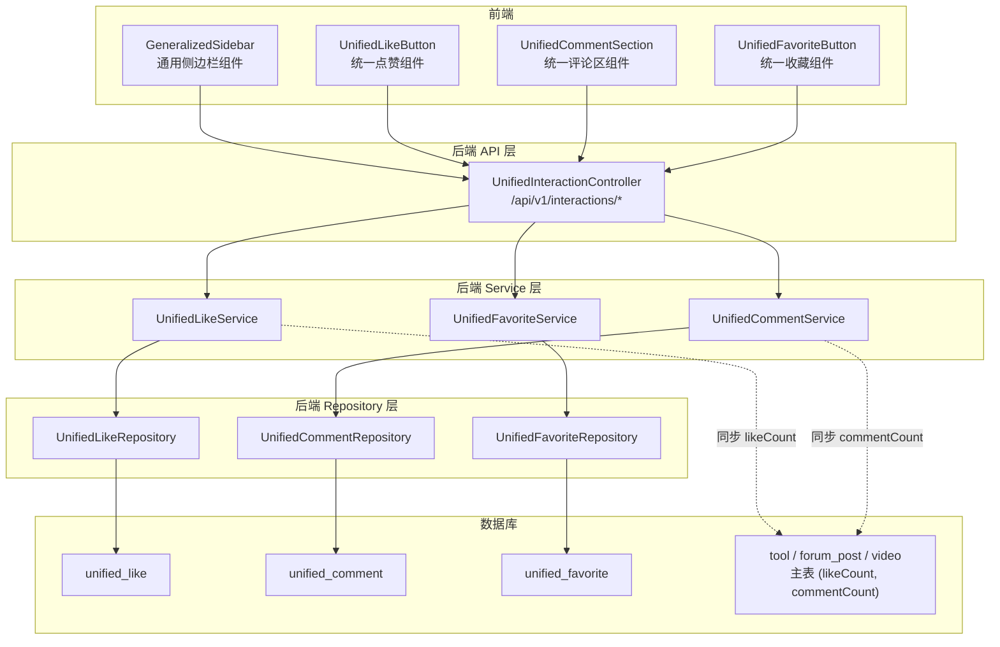
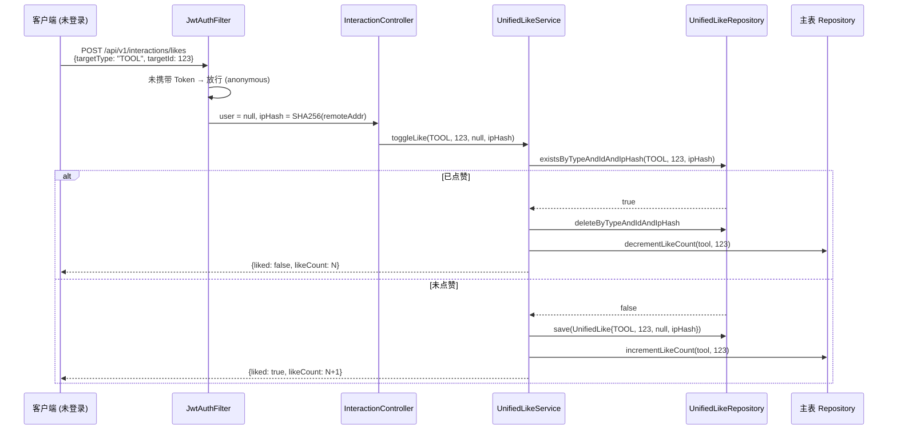
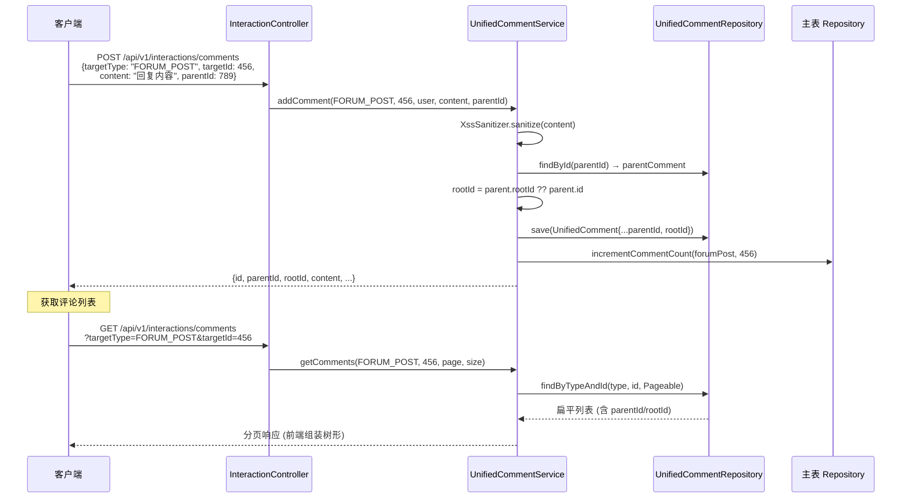
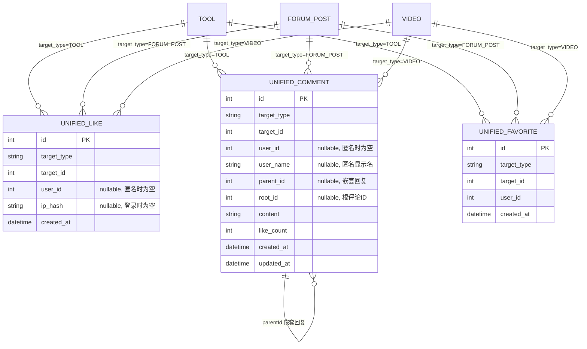

## 背景（Context）

CodingHub 平台有三个内容模块（工具 Tool、论坛 Forum、微课 Video），各自独立实现了点赞、评论、收藏功能，导致 10 张结构高度相似的数据库表、3 套重复的 Service/Repository 代码、3 种不一致的 API 风格和前端导航布局。

当前状态：

| 模块 | 点赞表 | 评论表 | 收藏表 | 评论嵌套 | 匿名点赞 | 前端导航 |
|------|--------|--------|--------|---------|---------|---------|
| 工具 | tool_like | tool_comment | 不存在 | 扁平 | 不支持 | 无侧边栏 |
| 论坛 | forum_like | forum_comment | post_favorites | parentId/rootId | ip_hash | SidebarNav |
| 微课 | video_like | video_comment | video_favorite | 扁平 | 不支持 | ProfilePage tab |

约束条件：Java 17 / Spring Boot 3.2.5、MySQL 8.x、Vue 3.4 + TypeScript、后端分层 controller → service → repository → model、API 认证使用 JWT（access 15min + refresh 7 天）。

## 目标 / 非目标（Goals / Non-Goals）

**目标：**

- 将 10 张交互表合并为 3 张通用表（unified_like / unified_comment / unified_favorite）
- 统一 API 为 `/api/v1/interactions/*`，一套 Controller + Service 服务三个模块
- 前端三个模块统一使用 GeneralizedSidebar 侧边栏导航（列表/我的/收藏）
- 补全工具模块的收藏功能
- 工具和微课评论支持嵌套回复（对齐论坛模式）
- 全模块支持匿名点赞（对齐论坛 ip_hash 模式）

**非目标：**

- 不重构内容主体表（tool、forum_post、video 保持不变）
- 不改变用户认证/鉴权体系
- 不引入 Redis 或消息队列等外部依赖
- 不做实时通知（点赞/评论通知）
- 不迁移旧 API 的 MCP 工具调用（MCP 继续使用各自模块的 Service）

## 决策（Decisions）

### D1：多态设计 — target_type VARCHAR + target_id

**选择**：使用 VARCHAR(20) target_type + BIGINT target_id 标识目标资源。target_type 枚举值为 TOOL、FORUM_POST、VIDEO，应用层校验。

**备选方案**：
- MySQL ENUM 类型 — 限制严格但新增类型需 ALTER TABLE，排除
- 独立外键列（tool_id / post_id / video_id 三选一非空）— 表结构清晰但扩展性差，每加一个模块就要加列，排除

### D2：统一 API 路径 — /api/v1/interactions/*

**选择**：所有交互操作收口到 `/api/v1/interactions/likes`、`/comments`、`/favorites`，通过 body 中的 targetType + targetId 区分资源。

**备选方案**：
- 保留各模块独立路径（如 `/api/v1/tools/{id}/like`），后端统一转发 — 前端改动小但 API 冗余，且新模块还要复制一套路由，排除

### D3：砍掉评论点赞

**选择**：移除 comment 级别的点赞功能（当前仅论坛有且未完整实现 unlikeComment）。统一后 unified_like 只服务于内容主体（TOOL / FORUM_POST / VIDEO）。

**备选方案**：
- unified_like 加 target_type = 'COMMENT' — 真正统一但增加复杂度，且评论点赞使用率极低，排除

### D4：保留主表冗余计数字段

**选择**：tool / forum_post / video 主表保留 likeCount、commentCount 字段，Service 层在 like/unlike/comment 操作时同步更新。

**备选方案**：
- 实时 COUNT 查询 — 无冗余但列表页性能差（N+1），排除

### D5：数据迁移 — 一次性脚本

**选择**：编写 SQL 迁移脚本将 10 张旧表数据 INSERT INTO 3 张新表，迁移完成后旧表改名为 `*_deprecated`。不做双写过渡。

**备选方案**：
- 双写过渡期（新旧表同时写入，逐步切换读取）— 更安全但实现复杂，本项目规模不需要，排除

## 架构图



## 时序图

### 匿名点赞流程



### 嵌套评论流程



## 数据模型



### 表结构详细定义

```sql
-- unified_like
CREATE TABLE unified_like (
    id BIGINT AUTO_INCREMENT PRIMARY KEY,
    target_type VARCHAR(20) NOT NULL COMMENT 'TOOL / FORUM_POST / VIDEO',
    target_id BIGINT NOT NULL,
    user_id BIGINT NULL COMMENT '登录用户ID，匿名时为NULL',
    ip_hash VARCHAR(64) NULL COMMENT 'SHA256(IP)，登录时为NULL',
    created_at DATETIME DEFAULT CURRENT_TIMESTAMP,
    UNIQUE KEY uk_like_user (target_type, target_id, user_id),
    UNIQUE KEY uk_like_anon (target_type, target_id, ip_hash),
    INDEX idx_like_target (target_type, target_id)
);

-- unified_comment
CREATE TABLE unified_comment (
    id BIGINT AUTO_INCREMENT PRIMARY KEY,
    target_type VARCHAR(20) NOT NULL COMMENT 'TOOL / FORUM_POST / VIDEO',
    target_id BIGINT NOT NULL,
    user_id BIGINT NULL COMMENT '登录用户ID，匿名时为NULL',
    user_name VARCHAR(50) NULL COMMENT '匿名用户显示名',
    parent_id BIGINT NULL COMMENT '父评论ID，顶层为NULL',
    root_id BIGINT NULL COMMENT '根评论ID，顶层为NULL',
    content TEXT NOT NULL,
    like_count INT DEFAULT 0,
    created_at DATETIME DEFAULT CURRENT_TIMESTAMP,
    updated_at DATETIME DEFAULT CURRENT_TIMESTAMP ON UPDATE CURRENT_TIMESTAMP,
    INDEX idx_comment_target (target_type, target_id, created_at),
    INDEX idx_comment_root (root_id)
);

-- unified_favorite
CREATE TABLE unified_favorite (
    id BIGINT AUTO_INCREMENT PRIMARY KEY,
    target_type VARCHAR(20) NOT NULL COMMENT 'TOOL / FORUM_POST / VIDEO',
    target_id BIGINT NOT NULL,
    user_id BIGINT NOT NULL COMMENT '收藏必须登录',
    created_at DATETIME DEFAULT CURRENT_TIMESTAMP,
    UNIQUE KEY uk_fav (user_id, target_type, target_id),
    INDEX idx_fav_user (user_id, target_type)
);
```

### 废弃表清单

| 旧表 | 迁移目标 | 数据量预估 |
|------|---------|-----------|
| tool_like | unified_like (target_type=TOOL) | 小 |
| tool_comment | unified_comment (target_type=TOOL) | 小 |
| forum_like | unified_like (target_type=FORUM_POST) | 中 |
| forum_comment | unified_comment (target_type=FORUM_POST) | 中 |
| post_favorites | unified_favorite (target_type=FORUM_POST) | 小 |
| video_like | unified_like (target_type=VIDEO) | 小 |
| video_comment | unified_comment (target_type=VIDEO) | 小 |
| video_favorite | unified_favorite (target_type=VIDEO) | 小 |

注：forum_like 中的 comment 点赞记录（comment_id 非空的行）不迁移，因为评论点赞功能被砍掉。

## API 设计

### 统一端点

| 方法 | 路径 | 说明 | 认证 |
|------|------|------|------|
| POST | /api/v1/interactions/likes | 点赞切换 (toggle) | 可选（支持匿名） |
| GET | /api/v1/interactions/likes/status | 查询点赞状态 | 可选 |
| GET | /api/v1/interactions/comments | 评论列表 (分页) | 否 |
| POST | /api/v1/interactions/comments | 创建评论/回复 | 可选（支持匿名） |
| DELETE | /api/v1/interactions/comments/{id} | 删除评论 | isOwner or isAdmin |
| POST | /api/v1/interactions/favorites | 收藏切换 (toggle) | 是 |
| GET | /api/v1/interactions/favorites | 我的收藏列表 (分页) | 是 |
| GET | /api/v1/interactions/favorites/status | 查询收藏状态 | 是 |

### 请求/响应格式

**POST /api/v1/interactions/likes**

请求：
```json
{
  "targetType": "TOOL",
  "targetId": 123
}
```

响应（toggle 模式）：
```json
{
  "code": 200,
  "data": {
    "liked": true,
    "likeCount": 42
  }
}
```

**POST /api/v1/interactions/comments**

请求（顶层评论）：
```json
{
  "targetType": "FORUM_POST",
  "targetId": 456,
  "content": "很好的帖子"
}
```

请求（嵌套回复）：
```json
{
  "targetType": "FORUM_POST",
  "targetId": 456,
  "content": "同意你的观点",
  "parentId": 789
}
```

响应：
```json
{
  "code": 200,
  "data": {
    "id": 1001,
    "parentId": 789,
    "rootId": 750,
    "userId": 2,
    "userName": "wangbao",
    "content": "同意你的观点",
    "likeCount": 0,
    "createdAt": "2026-06-21T10:00:00Z"
  }
}
```

**POST /api/v1/interactions/favorites**

请求：
```json
{
  "targetType": "TOOL",
  "targetId": 123
}
```

响应（toggle 模式）：
```json
{
  "code": 200,
  "data": {
    "favorited": true
  }
}
```

**GET /api/v1/interactions/favorites?targetType=TOOL&page=0&size=10**

响应：
```json
{
  "code": 200,
  "data": {
    "content": [
      { "id": 123, "name": "AI 代码审查工具", "..." : "..." }
    ],
    "totalElements": 5,
    "page": 0,
    "size": 10
  }
}
```

注意：收藏列表的响应内容取决于 targetType，工具返回 ToolSummaryDTO，帖子返回 ForumPostDTO，视频返回 VideoListItem。Service 层根据 targetType 调用对应模块的 Repository 获取详情。

## 前端架构

### GeneralizedSidebar 组件

```
组件：GeneralizedSidebar.vue
位置：frontend/src/components/common/GeneralizedSidebar.vue

Props:
  items: Array<{ label: string, icon: Component, to: string, requiresAuth?: boolean }>

行为：
  - 200px 固定宽度，sticky 定位
  - 毛玻璃背景 (var(--bg-glass) + backdrop-filter)
  - requiresAuth 的项仅登录用户可见 (v-if="authStore.isLoggedIn")
  - 当前路由匹配时高亮 (active class)

各模块使用：
  工具：[{label:'工具列表', icon:LayoutGrid, to:'/tools'},
         {label:'我的工具', icon:FileText, to:'/my-tools', requiresAuth:true},
         {label:'我的收藏', icon:Bookmark, to:'/my-favorites', requiresAuth:true}]
  论坛：[{label:'帖子列表', icon:LayoutGrid, to:'/forum'},
         {label:'我的帖子', icon:FileText, to:'/forum/my-posts', requiresAuth:true},
         {label:'我的收藏', icon:Bookmark, to:'/forum/my-favorites', requiresAuth:true}]
  微课：[{label:'微课列表', icon:LayoutGrid, to:'/videos'},
         {label:'我的微课', icon:PlayCircle, to:'/videos/my-videos', requiresAuth:true},
         {label:'我的收藏', icon:Bookmark, to:'/videos/my-favorites', requiresAuth:true}]
```

### 页面布局改造

所有列表页统一为 sidebar + content 双栏布局：

```
┌───────────────────────────────────────────┐
│ .page-layout (display: flex, gap: 24px)   │
│ ┌──────────┐ ┌──────────────────────────┐ │
│ │ Sidebar  │ │ Content Area (flex: 1)   │ │
│ │ 200px    │ │                          │ │
│ │ sticky   │ │  Page Header             │ │
│ │          │ │  Grid / List Content     │ │
│ │          │ │  Pagination              │ │
│ └──────────┘ └──────────────────────────┘ │
└───────────────────────────────────────────┘

移动端 (≤768px): sidebar 折叠为顶部 tab bar
```

### 新增路由

| 路径 | 组件 | 说明 |
|------|------|------|
| /my-favorites | MyToolFavoritesPage.vue | 工具收藏列表 |
| /videos/my-videos | MyVideosPage.vue | 我的微课列表 |
| /videos/my-favorites | MyVideoFavoritesPage.vue | 微课收藏列表 |

### 废弃/改造组件

| 组件 | 处理 |
|------|------|
| SidebarNav.vue (forum) | 废弃，替换为 GeneralizedSidebar |
| ToolLikeButton | 废弃，替换为 UnifiedLikeButton |
| ToolCommentList / ToolCommentEditor | 废弃，替换为 UnifiedCommentSection |
| VideoCommentList | 废弃，替换为 UnifiedCommentSection |
| ProfilePage 的视频/收藏 tab | 移除，迁移为独立页面 |

## 风险 / 权衡（Risks / Trade-offs）

- **[风险] 数据迁移丢失** → 迁移前完整备份旧表（RENAME 而非 DROP），迁移脚本先在开发环境验证
- **[风险] 旧 API 调用方中断** → MCP 工具调用仍直接使用各模块 Service（不经过 InteractionController），无需改动 MCP 层
- **[风险] target_type + target_id 无数据库级外键约束** → 应用层校验 targetType 枚举值，Service 层在 like/comment/favorite 前验证目标资源存在性
- **[风险] 匿名点赞 IP 碰撞** → 同一 IP 的不同匿名用户共享一个点赞（与现有论坛行为一致，可接受）
- **[权衡] 统一 API vs 独立路径** → 牺牲了一点路由可读性（`/interactions/likes` 不如 `/tools/{id}/like` 直观），换取了扩展性（新模块零成本接入）

## 迁移计划（Migration Plan）

### 部署步骤

1. 执行 SQL 迁移脚本：创建 3 张新表 → INSERT INTO 迁移数据 → RENAME 旧表为 `*_deprecated`
2. 部署后端新版本（含 UnifiedInteractionController + Service + Repository）
3. 部署前端新版本（含 GeneralizedSidebar + 统一交互组件）
4. 验证所有交互功能正常

### 回滚策略

- 旧表 RENAME 保留，未 DROP
- 如需回滚：DROP 新表 → RENAME `*_deprecated` 恢复旧表 → 回滚代码部署
- 回滚后旧 API 端点恢复可用

## 待定问题（Open Questions）

无。所有关键决策已在探索阶段确定。
