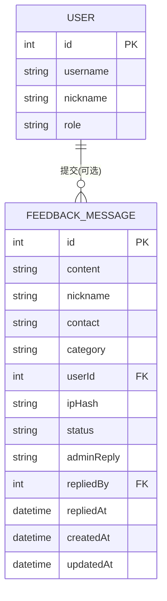
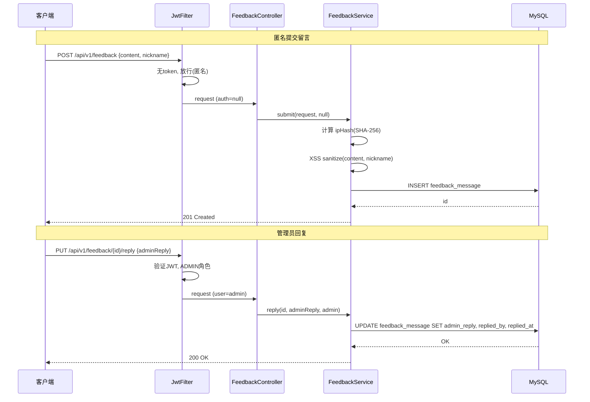

## 背景（Context）

CodingHub 已有工具广场、论坛、微课三大内容模块，统一交互系统（点赞/评论/收藏）已支持匿名操作。现需新增轻量留言板，让用户提交意见和建议，支持匿名提交，管理员可回复和删除。

现有架构参考：
- 匿名模式：`UnifiedInteractionController` 中的 `getCurrentUser()` 模式——有 token 解析用户，无 token 走匿名 + ipHash 防刷
- XSS 防护：`XssSanitizer.sanitize()` 用于用户输入
- 分层结构：controller → service → repository → model，DTO 用 Java record

约束条件：
- 不需要审核流程，留言直接展示
- 不需要统一交互系统集成（不加点赞/评论/收藏）
- 管理员回复直接写在留言记录的 `admin_reply` 字段，不建独立回复表

## 目标 / 非目标（Goals / Non-Goals）

**目标：**
- 用户可提交留言（内容必填，昵称/联系方式/分类可选），支持匿名
- 留言提交后直接公开展示，按时间倒序分页查询
- 管理员可回复留言和软删除留言
- 前端单页面完成提交 + 列表浏览 + 管理员操作

**非目标：**
- 不做留言之间的评论、点赞、收藏
- 不做审核流程（先审后发）
- 不做文件上传/附件
- 不做标签系统（用 category 枚举替代）
- 不做用户间私信/聊天

## 决策（Decisions）

### 1. 数据模型：单表 vs 主从表

**决策：单表 `feedback_message`**

管理员回复直接写在本表的 `admin_reply`、`replied_by`、`replied_at` 字段。理由：轻量模式下一条留言最多一个管理员回复，不需要多轮对话，不值得建独立的回复表。

备选方案：主表 + 回复表（`feedback_reply`），适合多管理员多轮回复场景，但增加复杂度，当前不需要。

### 2. 匿名模式：复用统一交互 vs 独立实现

**决策：独立实现，参考统一交互的匿名模式**

留言板不接入统一交互系统（`TargetType` 不新增），因为留言板不是"对内容的点赞/评论"，而是独立的内容实体。匿名逻辑参考 `UnifiedInteractionController.getCurrentUser()` 模式自行实现：有 JWT 则关联 userId，无 JWT 则 userId 为 null + 记录 ipHash。

### 3. API 路径：`/api/v1/feedback` vs `/api/feedback`

**决策：`/api/v1/feedback`**

论坛模块用的是 `/api/forum/`（不带 v1），是历史遗留。新模块统一走 `/api/v1/` 前缀，与工具、微课、通知等模块保持一致。

### 4. 分类字段：枚举 vs 独立表

**决策：VARCHAR 字段存枚举值**

`category` 字段使用 `VARCHAR(20)` 存储预定义值（`SUGGESTION`、`BUG_REPORT`、`PRAISE`、`OTHER`），不需要建独立的分类表。前端用下拉选择器限制输入，后端用 Java 枚举校验。

## 数据模型

`userId` 可为 null（匿名提交），`repliedBy` 引用回复管理员的 `user.id`。`status` 仅 `NORMAL` / `DELETED` 两态。

## 时序图

## 风险 / 权衡（Risks / Trade-offs）

- **[匿名垃圾信息]** → 无审核机制，垃圾留言会直接展示。缓解：ipHash 记录 + 管理员可软删除。后续可考虑增加审核开关。
- **[匿名身份伪造]** → 昵称字段可随意填写，可能冒充他人。缓解：前端对已登录用户隐藏昵称输入框（自动显示用户名），匿名用户的昵称仅为展示用途，不做身份验证。
- **[单表扩展性]** → 如果需要多轮回复或评论，单表不够用。缓解：当前定位轻量留言板，如果后续需求升级，可以迁移到主从表结构。

## 迁移计划（Migration Plan）

1. Flyway 迁移脚本 `V8__create_feedback_table.sql` 创建 `feedback_message` 表
2. Makefile `db` target 同步添加建表 SQL
3. 后端新增子包，前端新增页面和路由
4. SecurityConfig 添加权限规则
5. 无数据迁移，无破坏性变更，可直接部署

## 待定问题（Open Questions）

- 是否需要限制单个 IP 的提交频率（rate limiting）？当前不做，后续按需添加。
- 管理员回复后是否需要通知留言者？匿名留言无法通知，已登录用户可走通知系统，但当前版本暂不实现。
