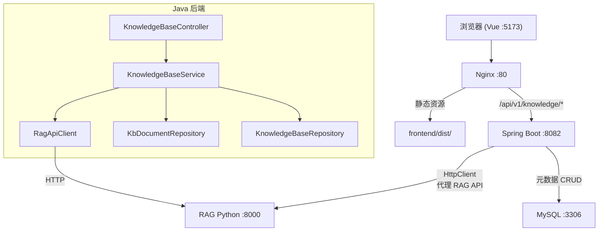
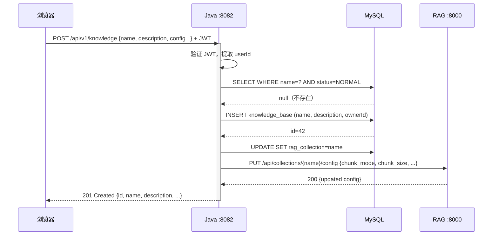
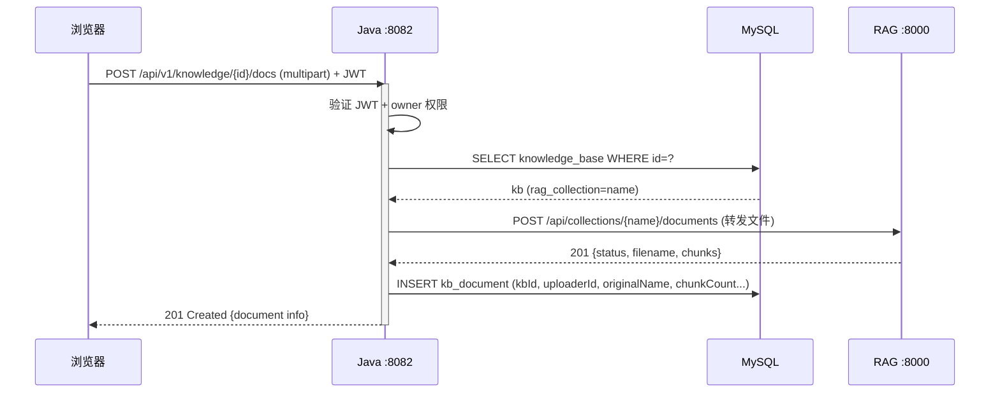
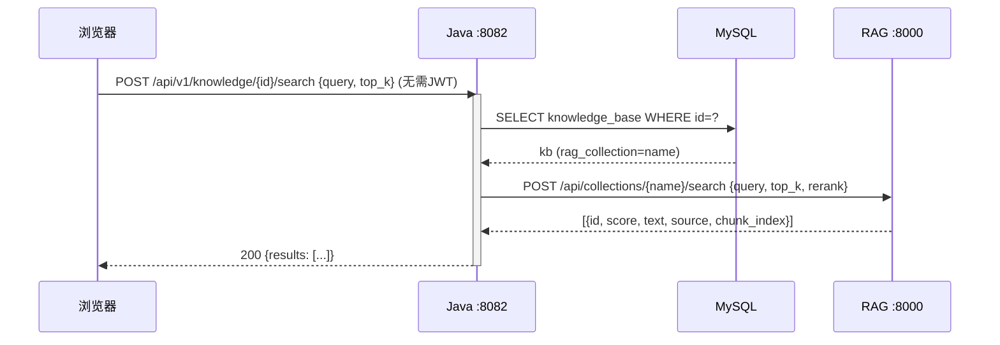
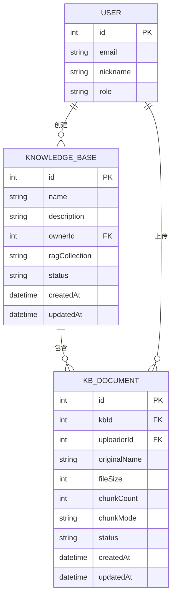

## 背景（Context）

CodingHub 是一个 AI 工具广场平台（Java 17 + Spring Boot 3.2.5 后端 + Vue 3.4 前端），已有工具、论坛、微课三大内容模块。RAG 服务（wandering-rag-mcp）是一个独立的 Python 服务，提供 9 个 REST API 端点用于 collection 管理、文档管理和语义搜索，目前运行在 localhost:8000。两者当前完全独立，无交互。

**约束条件：**
- Java 后端当前无任何 HTTP 客户端依赖（无 RestTemplate/WebClient/HttpClient）
- RAG 服务无认证机制，所有端点开放
- RAG collection 使用文件夹名作为标识，配置存储在 `_config.json`
- CodingHub 使用 JWT 认证（15 分钟过期 + 7 天 refresh），User 实体作为 `@AuthenticationPrincipal`
- 数据库使用 JPA `ddl-auto: update` 自动建表
- 实体使用 FK ID（无 `@ManyToOne`），关系在 Service 层手动解析

## 目标 / 非目标（Goals / Non-Goals）

**目标：**
- 在 CodingHub 中实现完整的知识库生命周期管理（创建/浏览/编辑/删除）
- 实现文档上传/删除/列表管理
- 实现知识库参数配置（chunk_mode/chunk_size/chunk_overlap/rerank）
- 实现基于知识库的语义搜索（返回文本片段，非对话式）
- 登录用户可创建知识库，未登录用户可浏览和使用搜索
- Java 后端作为中间层统一处理权限和 RAG 代理

**非目标：**
- 不做 LLM 对话式问答（仅搜索片段返回）
- 不做知识库的点赞/收藏/评论（不扩展 unified-interactions）
- 不做知识库的标签系统
- 不做 Nginx 直连 RAG（所有 RAG 调用走 Java 中转）
- 不做 RAG 服务本身的部署或运维

## 决策（Decisions）

### D1: 混合模式——MySQL 元数据 + RAG 向量存储

**选择**：MySQL 存储知识库和文档的元数据（名称、描述、所有者、状态），RAG 服务负责向量数据和检索。

**备选方案：**
- 薄代理模式（前端直连 RAG via Nginx）：改动最少，但无法实现用户归属和权限控制
- 纯 MySQL 模式（Java 自建向量检索）：需自建 embedding + 向量库，重复造轮子

**理由**：用户明确要求"登录后才能创建"，需要用户体系。MySQL 元数据与 CodingHub 现有模式一致（Tool/ForumPost/Video 都是 MySQL 元数据 + 外部存储）。

### D2: RAG collection 名 = 用户输入名

**选择**：直接使用用户输入的知识库名称作为 RAG collection 标识。Java 层通过 MySQL 查重防止重名（返回 409 Conflict）。

**备选方案：**
- `kb_{mysqlId}` 前缀命名：保证唯一但用户不可识别
- 自动生成 slug：增加复杂度，中文名需额外处理

**理由**：RAG 的 collection 名出现在搜索结果和文件路径中，使用用户命名更直观。Starlette 自动处理 URL 中的中文 percent-encoding，文件系统支持 UTF-8 目录名。

### D3: java.net.http.HttpClient 作为 HTTP 客户端

**选择**：使用 JDK 11+ 内置的 `java.net.http.HttpClient`，零额外依赖。

**备选方案：**
- RestTemplate：Spring 经典方案，但需要额外配置 bean
- WebClient：响应式，需引入 `spring-boot-starter-webflux` 依赖
- OkHttp/Feign：第三方依赖

**理由**：项目当前零 HTTP 客户端依赖，`java.net.http.HttpClient` 内置于 JDK 17，API 简洁，支持同步调用，无需引入新依赖。知识库 API 调用不需要异步/响应式。

### D4: 搜索返回片段而非对话式回答

**选择**：调用 RAG `/search` API 返回 chunk 文本片段（含来源文档名、相关度分数），前端以卡片形式展示。

**备选方案：**
- 对话式（RAG 检索 + LLM 生成回答）：需接入 LLM API，增加复杂度和延迟

**理由**：用户明确选择搜索片段模式。实现简单，响应快，后续可叠加 LLM 层。

### D5: 配置默认值与 RAG 对齐

**选择**：前端高级配置默认值直接使用 RAG 的 `DEFAULT_COLLECTION_CONFIG`：`structural/800/50/true`。高级配置区域默认折叠，用户不展开则使用默认值。

**理由**：减少用户认知负担，默认值已针对大多数文档场景优化。

## 架构图



## 时序图

### 创建知识库



### 上传文档



### 语义搜索



## 数据模型



**knowledge_base 表说明：**
- `name` VARCHAR(100) NOT NULL，UNIQUE 约束（配合 status=NORMAL）
- `rag_collection` VARCHAR(100)，创建后填充，等于 `name`
- `status` ENUM: NORMAL / DELETED（软删除，与现有模式一致）
- `owner_id` BIGINT FK → user.id

**kb_document 表说明：**
- `original_name` VARCHAR(255)：用户上传时的原始文件名
- `chunk_count` INT：RAG 返回的分块数
- `chunk_mode` VARCHAR(20)：实际使用的分块模式
- `file_size` BIGINT：文件大小（bytes）

### 后端 API 设计

| 方法 | 端点 | 权限 | 说明 |
|------|------|------|------|
| GET | `/api/v1/knowledge` | 公开 | 知识库列表（分页，hot/latest 排序） |
| GET | `/api/v1/knowledge/{id}` | 公开 | 知识库详情 |
| POST | `/api/v1/knowledge` | 登录 | 创建知识库 |
| PUT | `/api/v1/knowledge/{id}` | owner/admin | 更新知识库信息（name/description） |
| DELETE | `/api/v1/knowledge/{id}` | owner/admin | 删除知识库（软删除 + 调 RAG 删除 collection） |
| GET | `/api/v1/knowledge/{id}/documents` | 公开 | 文档列表 |
| POST | `/api/v1/knowledge/{id}/documents` | owner | 上传文档（multipart） |
| DELETE | `/api/v1/knowledge/{id}/documents/{docId}` | owner/admin | 删除文档 |
| POST | `/api/v1/knowledge/{id}/search` | 公开 | 语义搜索 |
| GET | `/api/v1/knowledge/{id}/config` | 公开 | 查看配置 |
| PUT | `/api/v1/knowledge/{id}/config` | owner/admin | 更新配置 |

### RagApiClient 设计

```java
@Service
public class RagApiClient {
    private final HttpClient httpClient;
    private final String baseUrl; // from app.rag.base-url

    // Collection 操作
    void configureCollection(String name, KbConfigDTO config);
    KbConfigDTO getCollectionConfig(String name);
    void deleteCollection(String name);

    // 文档操作
    RagUploadResult uploadDocument(String collection, MultipartFile file,
                                    Integer chunkSize, String chunkMode);
    void deleteDocument(String collection, String filepath);
    List<RagDocumentDTO> listDocuments(String collection);

    // 搜索
    List<RagSearchResult> search(String collection, String query,
                                  int topK, boolean rerank);
}
```

### 前端路由设计

| 路径 | 组件 | 权限 | 说明 |
|------|------|------|------|
| `/knowledge` | KnowledgeListPage | 公开 | 知识库列表 |
| `/knowledge/create` | KnowledgeEditorPage | requiresAuth | 创建知识库 |
| `/knowledge/:id` | KnowledgeDetailPage | 公开 | 知识库详情+搜索 |
| `/knowledge/:id/manage` | KnowledgeDetailPage (manage tab) | requiresAuth | 文档管理+配置 |

## 风险 / 权衡（Risks / Trade-offs）

- **[风险] RAG 服务不可用** → Java 层对 RAG 调用设置超时（10s），失败时返回 503 并提示"RAG 服务暂时不可用"。知识库列表/详情等纯 MySQL 操作不受影响。
- **[风险] 知识库名称重名** → Java 层在创建时先查 MySQL（status=NORMAL），存在则返回 409。RAG 端无并发创建问题（单实例部署）。
- **[权衡] collection 名用中文** → URL 中需 percent-encode，日志可读性下降。但用户可直观识别知识库，且 Starlette 自动处理编码。
- **[权衡] 配置不双写 MySQL** → RAG 的 `_config.json` 作为配置 source of truth，避免双写一致性问题。代价是知识库列表页无法直接展示配置信息（需额外调 RAG API）。
- **[风险] 大文件上传超时** → RAG 处理大文档（尤其 PDF 转换+向量化）可能耗时较长。Java 层设置较长的 HTTP 超时（300s），前端显示上传进度。

## 迁移计划（Migration Plan）

无需数据迁移。JPA `ddl-auto: update` 自动创建新表。RAG 服务需独立启动（不在本次变更范围内）。

**部署检查清单：**
1. 启动 RAG Python 服务（`python server.py --transport sse --port 8000`）
2. 确认 `application.yml` 中 `app.rag.base-url=http://localhost:8000`
3. 重启 Java 后端（自动建表）
4. 构建前端（`npm run build`）

## 待定问题（Open Questions）

无。所有设计决策已在探索阶段确认。
