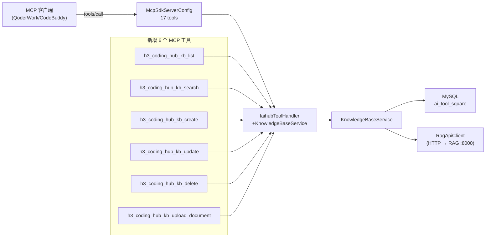
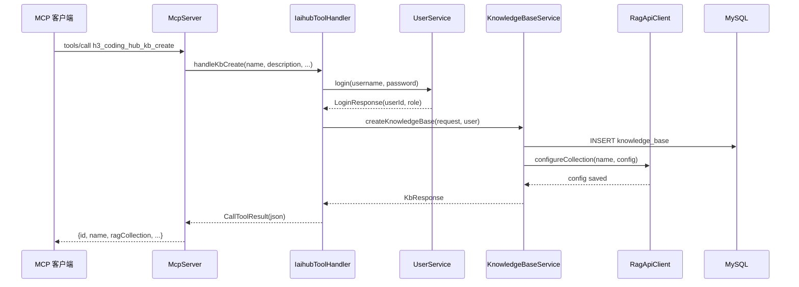
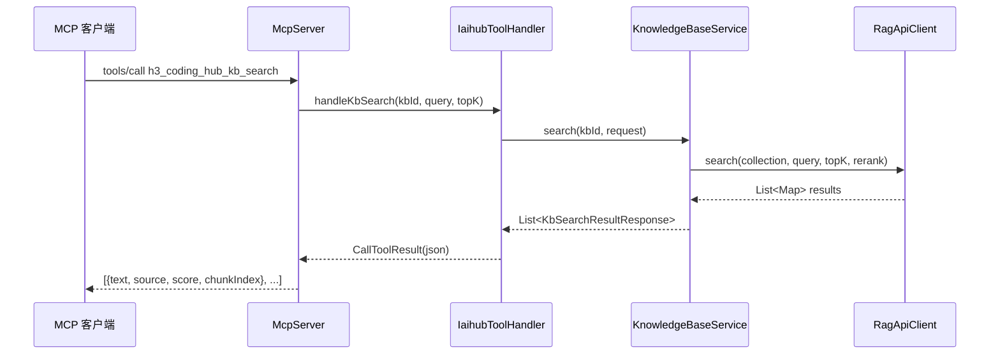

## 背景（Context）

CodingHub MCP Server 当前暴露 11 个工具，覆盖工具搜索/创建/修改、帖子搜索/创建、文件上传/下载/删除。知识库 REST API 已完整实现（KnowledgeBaseController + KnowledgeBaseService + RagApiClient），但 MCP 层尚未暴露知识库操作能力。AI 助手客户端无法通过 MCP 协议管理知识库。

**约束：**
- MCP 传输层无 session/JWT，写操作必须通过 username/password 参数内联认证
- 知识库写操作（创建/编辑/删除/上传文档/修改配置）在 REST API 层需要 JWT 认证
- KnowledgeBaseService 已封装所有业务逻辑和 RAG 调用，MCP handler 应直接复用

## 目标 / 非目标（Goals / Non-Goals）

**目标：**
- 通过 MCP 协议暴露知识库核心操作，使 AI 助手能管理知识库
- 读操作公开（与 REST API 一致），写操作通过 username/password 内联认证
- 工具命名遵循现有 `h3_coding_hub_` 前缀规范
- 复用 KnowledgeBaseService，不在 MCP 层重复业务逻辑

**非目标：**
- 不新增数据库表或修改现有数据模型
- 不修改前端代码（纯后端变更）
- 不实现知识库问答对话功能（仅返回搜索片段，由客户端自行决定如何呈现）
- 不实现文档内容的 MCP 直传（文件上传通过返回 REST API 信息，客户端 HTTP 直传）

## 决策（Decisions）

### 决策 1：工具粒度 — 6 个独立工具 vs 合并工具

**选择：6 个独立工具**

备选方案：
- A) 单一 `h3_coding_hub_kb_manage` 工具，通过 action 参数区分操作 → 拒绝：MCP 工具应单一职责，action 分发增加客户端复杂度
- B) 6 个独立工具 → 选中：每个工具职责清晰，input schema 精确，客户端易于发现和调用

### 决策 2：文档上传方式 — MCP 直传 vs REST API 引导

**选择：REST API 引导（返回上传接口信息）**

备选方案：
- A) MCP 工具接收 base64 文件内容 → 拒绝：MCP 协议不适合传输大文件二进制，且现有 tool_file_upload 工具已采用 REST API 引导模式，保持一致
- B) 返回 REST API 上传信息 → 选中：与 `h3_coding_hub_tool_file_upload` 模式一致，客户端通过 HTTP multipart 直传，无需认证（SecurityConfig 已放通）

### 决策 3：认证方式 — 复用内联 username/password

**选择：复用现有内联认证模式**

备选方案：
- A) 新增 MCP 层 token 机制 → 拒绝：增加复杂度，与现有工具不一致
- B) 复用 username/password 内联认证 → 选中：与 tool_create/post_create 等工具完全一致，零学习成本

### 决策 4：搜索工具范围 — 单库搜索 vs 跨库搜索

**选择：单库搜索（需要 kbId）**

备选方案：
- A) 跨库全局搜索 → 拒绝：RAG 服务以 collection 为单位隔离，跨库搜索需要遍历所有 collection，性能差且结果混杂
- B) 单库搜索 → 选中：先通过 kb_list 获取知识库列表，再指定 kbId 搜索，职责清晰

## 架构图

## 时序图

### 创建知识库流程

### 语义搜索流程

## 风险 / 权衡（Risks / Trade-offs）

- **[RAG 服务不可用]** → 读操作（list/search）会返回错误，写操作（create）的 RAG 配置步骤已做容错处理（log.warn 不抛异常），知识库 MySQL 记录仍可创建
- **[MCP 工具数量增长]** → 从 11 增至 17 个工具，客户端工具列表变长。缓解：工具命名有清晰的 `kb_` 分组前缀
- **[文件上传安全]** → 文档上传 REST API 已放通认证（SecurityConfig），任何知道 URL 的人都可以上传。缓解：上传需要知道 kbId，且 RAG 服务本身无敏感数据暴露
- **[username/password 明文传输]** → MCP 客户端需在 tool arguments 中传入密码。缓解：与现有 tool_create/post_create 工具保持一致，MCP 通道通常为本地/内网通信

## 待定问题（Open Questions）

- 是否需要 `h3_coding_hub_kb_get_config` / `h3_coding_hub_kb_update_config` 工具？当前 6 个工具未包含配置管理，如需要可后续追加
- 是否需要 `h3_coding_hub_kb_list_documents` / `h3_coding_hub_kb_delete_document` 工具？当前通过 upload_document 返回文档信息，列表和删除可后续追加
