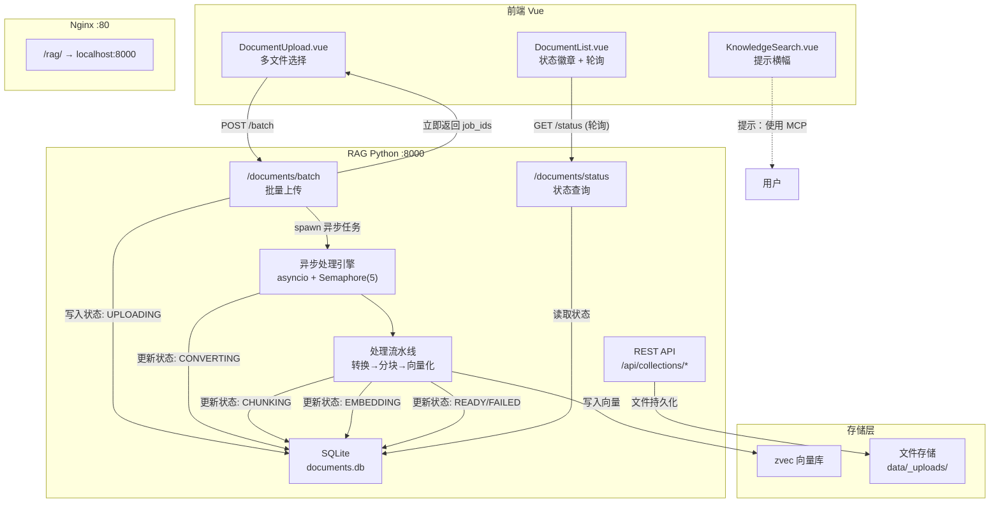
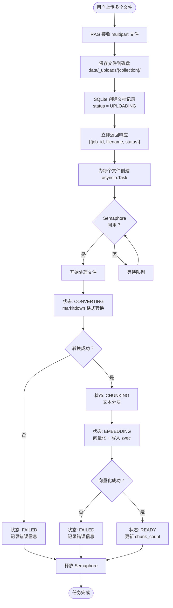
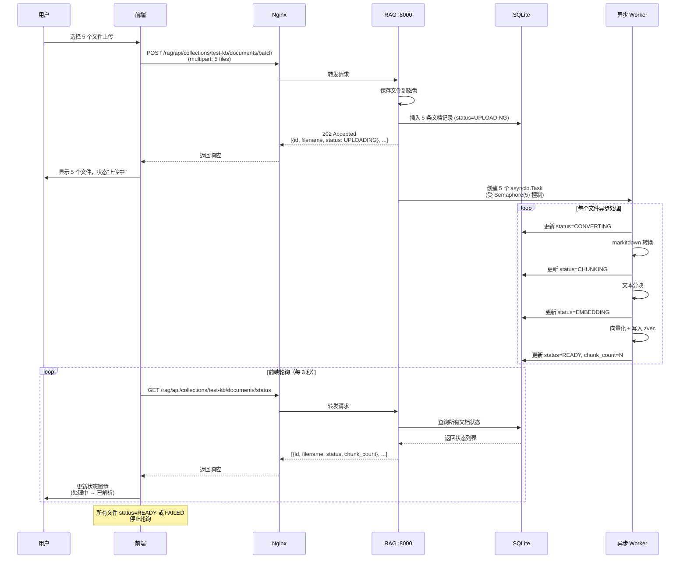
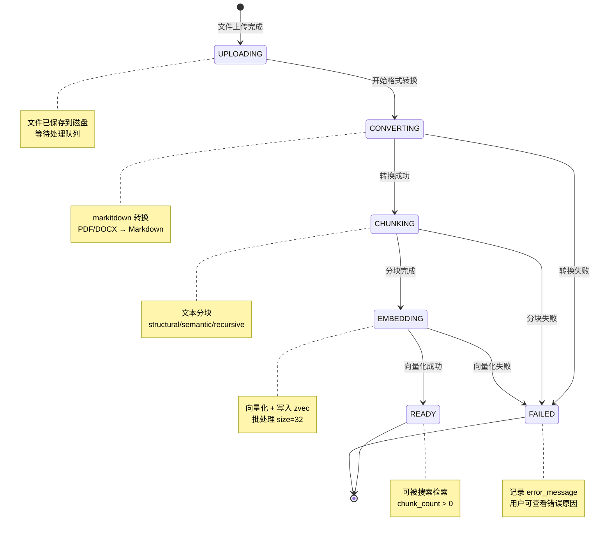
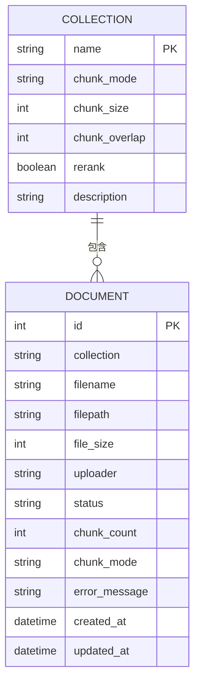

## 背景（Context）

CodingHub 知识库当前采用前端直连 RAG Python 服务的架构（direct-rag-document-api 变更已实施）。文档上传为同步模式：前端通过 multipart/form-data 上传文件到 RAG 服务，RAG 服务在同一请求内完成格式转换（markitdown）、文本分块（chunking）、向量化（embedding）并写入向量数据库，最后返回结果。

**现状问题：**
- 单文件上传：用户每次只能选择一个文件，多文件需多次操作
- 同步阻塞：大文档处理耗时数分钟，HTTP 连接长时间保持，前端无法展示详细进度
- 状态不透明：用户无法区分"正在转换格式"、"正在分块"、"正在计算向量"等阶段
- 元数据缺失：现有 `_registry.json` 仅存储 `chunk_count` 和 `file_hash`，无上传者、时间、状态等信息
- 搜索认知偏差：用户误以为页面搜索具备完整 AI 理解能力

**技术约束：**
- RAG 服务为独立 Python 进程（FastAPI/Starlette），无外部消息队列或任务系统
- 向量数据库使用 zvec（嵌入式），与 RAG 服务同机部署
- 前端通过 Nginx 反向代理访问 RAG 服务（`/rag/` → `localhost:8000`）
- MCP 工具运行在 Java 后端，通过 HTTP 调用 RAG 服务

## 目标 / 非目标（Goals / Non-Goals）

**目标：**
- 支持单次请求批量上传多个文档（最多 20 个文件）
- 文档处理异步化：上传请求立即返回，后台并行处理，前端轮询状态
- 引入 SQLite 存储文档元数据和处理状态（6 种状态：UPLOADING → CONVERTING → CHUNKING → EMBEDDING → READY / FAILED）
- 提供状态查询 API，支持按 collection 查询所有文档状态
- 前端展示每个文档的实时处理状态，自动轮询更新
- 搜索页面增加提示，引导用户使用 MCP 接入 AI 助手
- MCP 工具支持批量上传指引和状态查询

**非目标：**
- 不实现跨服务任务队列（如 Celery/RabbitMQ），使用 asyncio + Semaphore 即可
- 不修改向量检索算法或分块策略
- 不实现文档版本管理或历史记录
- 不实现 WebSocket 实时推送（轮询足够）
- 不迁移现有 `_registry.json` 数据到新 SQLite（保持向后兼容，新文档写入 SQLite）

## 决策（Decisions）

### 决策 1：文档元数据存储 — SQLite vs MySQL vs JSON

**选择：SQLite（RAG 服务本地）**

备选方案：
- A) **SQLite**（选中）：RAG 服务本地文件数据库，无外部依赖，ACID 事务，支持并发读写，适合单机部署
- B) MySQL：需要连接远程数据库，增加网络延迟和配置复杂度，违背 RAG 服务独立性原则 → 拒绝
- C) 增强 `_registry.json`：JSON 文件不支持并发写入，无事务保障，查询效率低 → 拒绝

理由：RAG 服务是独立进程，文档元数据仅服务于文档状态查询，无需与 Java 后端共享。SQLite 零配置、高性能、支持并发（WAL 模式），完美契合场景。

### 决策 2：异步处理模型 — asyncio.Task + Semaphore

**选择：Python asyncio 原生异步 + Semaphore 并发控制**

备选方案：
- A) **asyncio.Task + Semaphore(5)**（选中）：轻量级，无外部依赖，最多 5 个文件并行处理，避免 OOM
- B) Celery + Redis：引入消息队列和 worker 进程，架构复杂度高，运维成本大 → 拒绝
- C) 线程池（ThreadPoolExecutor）：Python GIL 限制 CPU 密集型任务（embedding），不适合 → 拒绝

理由：文档处理是 I/O 密集（文件读写）+ CPU 密集（embedding）混合任务。asyncio 适合 I/O 等待（markitdown 转换、数据库写入），Semaphore 限制并发数避免资源耗尽。Embedding 模型推理虽为 CPU 密集，但 `sentence-transformers` 底层使用 PyTorch，会释放 GIL，多任务可真正并行。

### 决策 3：批量上传 API 设计

**选择：单端点 multipart 多文件上传**

```
POST /api/collections/{name}/documents/batch
Content-Type: multipart/form-data

files: [file1, file2, file3, ...]
```

备选方案：
- A) **单端点多文件**（选中）：一次请求上传多个文件，返回每个文件的 job_id，前端只需一次 HTTP 请求
- B) 前端并发多个单文件请求：前端逻辑复杂，需管理多个并发请求和进度 → 拒绝
- C) 分两步：先上传文件到临时目录，再触发批量处理 → 增加复杂度，无必要 → 拒绝

理由：multipart/form-data 原生支持多文件字段，HTTP 协议层面高效。服务端接收后立即返回 job_id 列表，后台异步处理。减少前端并发管理复杂度。

### 决策 4：状态查询 API 设计

**选择：集合级批量查询 + 单文档查询**

```
GET /api/collections/{name}/documents/status
→ 返回该集合所有文档的状态列表

GET /api/collections/{name}/documents/{doc_id}/status
→ 返回单个文档的详细状态（含错误信息）
```

理由：前端轮询时通常关心整个集合的处理进度（"还有几个文件没处理完？"），批量查询减少请求次数。单文档查询用于展示错误详情。

### 决策 5：Embedding 批处理大小可配置

**选择：环境变量 `RAG_EMBEDDING_BATCH_SIZE`，默认 32**

理由：`sentence-transformers` 的 `encode()` 方法支持 `batch_size` 参数。增大批处理大小可提升 GPU 利用率（如有 GPU），但会增加内存占用。默认 32 平衡性能与资源，用户可通过环境变量调整。

## 架构图



## 流程图



## 时序图



## 状态图



## 数据模型



**SQLite Schema:**

```sql
CREATE TABLE IF NOT EXISTS documents (
    id INTEGER PRIMARY KEY AUTOINCREMENT,
    collection TEXT NOT NULL,
    filename TEXT NOT NULL,
    filepath TEXT NOT NULL,
    file_size INTEGER DEFAULT 0,
    uploader TEXT,
    status TEXT NOT NULL DEFAULT 'UPLOADING',
    chunk_count INTEGER DEFAULT 0,
    chunk_mode TEXT,
    error_message TEXT,
    created_at DATETIME DEFAULT CURRENT_TIMESTAMP,
    updated_at DATETIME DEFAULT CURRENT_TIMESTAMP,
    UNIQUE(collection, filepath)
);

CREATE INDEX IF NOT EXISTS idx_doc_collection_status 
ON documents(collection, status);

CREATE INDEX IF NOT EXISTS idx_doc_created 
ON documents(collection, created_at DESC);
```

## 风险 / 权衡（Risks / Trade-offs）

- **[并发资源竞争]** → Semaphore(5) 限制同时处理文件数，避免内存溢出。若用户上传 20 个文件，15 个排队等待，总耗时较长。缓解：前端展示队列位置，用户可取消排队中的任务。
- **[SQLite 并发写入]** → 多个 asyncio.Task 同时更新状态可能触发 SQLite 锁。缓解：启用 WAL 模式（Write-Ahead Logging），支持并发读 + 串行写，性能足够。
- **[服务重启丢失任务]** → 异步任务在内存中，RAG 服务重启后丢失，处理中的文档状态停留在 UPLOADING/CONVERTING 等中间态。缓解：启动时扫描中间态文档，标记为 FAILED 并提供"重新处理"按钮。
- **[大文件上传超时]** → Nginx 默认 `client_max_body_size` 为 1MB，需调整至 100MB+。缓解：更新 Nginx 配置，设置 `client_max_body_size 200M`。
- **[轮询网络开销]** → 前端每 3 秒轮询一次，若文档处理耗时 10 分钟，产生 200 次请求。缓解：轮询间隔可配置，处理完成后立即停止；未来可升级为 SSE/WebSocket。
- **[SQLite vs MySQL 数据孤岛]** → 文档元数据仅存于 RAG 本地，Java 后端无法直接查询。缓解：Java 通过 RagApiClient 调用状态查询 API，保持 direct-rag 架构一致性。

## 迁移计划（Migration Plan）

### 部署步骤

1. **RAG 服务升级**：
   - 部署新代码（含 SQLite 数据库层、异步引擎、新 API 端点）
   - 首次启动自动创建 `data/documents.db`（SQLite 数据库）
   - 现有 `_registry.json` 保留，新文档写入 SQLite，旧文档仍可通过 zvec 检索
   
2. **Nginx 配置更新**：
   - 添加 `client_max_body_size 200M;` 到 `/rag/` location 块
   - 重载 Nginx：`nginx -s reload`
   
3. **Java 后端升级**：
   - 部署新代码（含 `batchUpload`、`getDocumentStatus` 方法）
   - 重启后端服务
   
4. **前端部署**：
   - 构建新版前端：`npm run build`
   - 部署静态资源到 Nginx

### 回滚策略

- RAG 服务：Git revert 到上一版本，删除 `data/documents.db`（新数据丢失，旧 `_registry.json` 不受影响）
- Java 后端：Git revert，重启
- 前端：Git revert，重新构建部署

## 待定问题（Open Questions）

1. **文件去重策略**：同一文件重复上传时，是覆盖（重新处理）还是跳过（基于 file_hash）？建议：默认跳过，提供 `force=true` 参数强制重新处理。
2. **批量删除**：是否需要支持批量删除文档？当前设计仅支持单文件删除。
3. **进度细化**：是否需要在 EMBEDDING 阶段展示百分比进度（如"已向量化 45/100 个分块"）？需要修改 embedding 批处理回调。
4. **失败重试**：FAILED 状态的文档是否提供"重试"按钮？需要新增 `POST /documents/{id}/retry` 端点。
