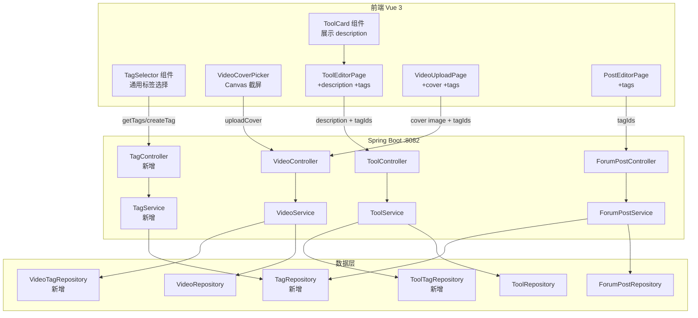
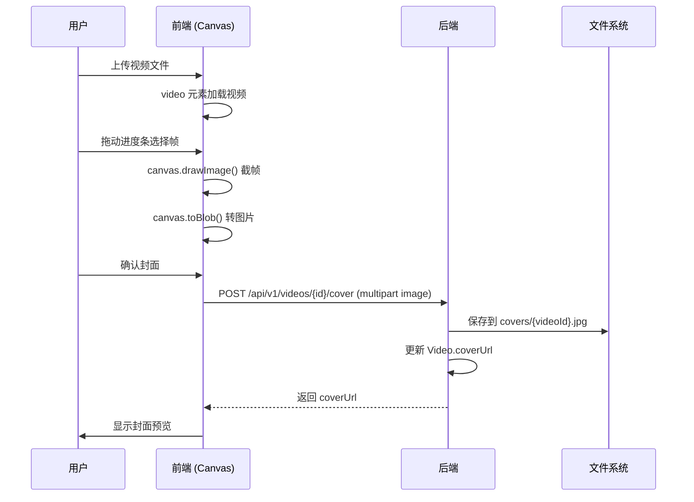
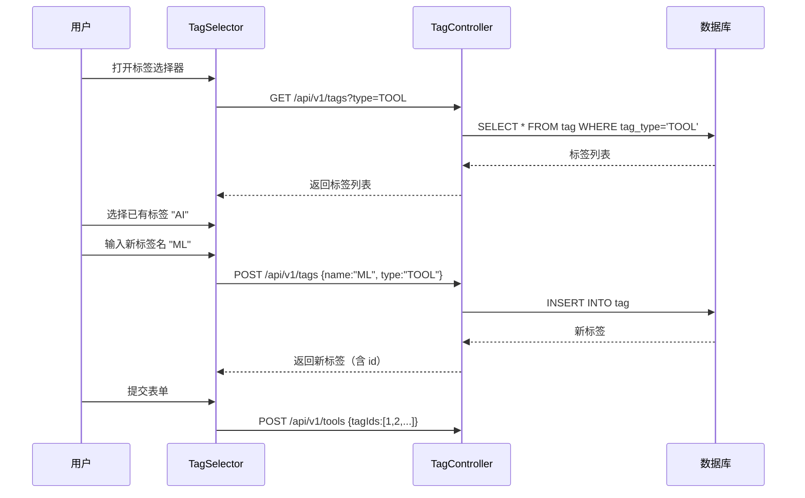
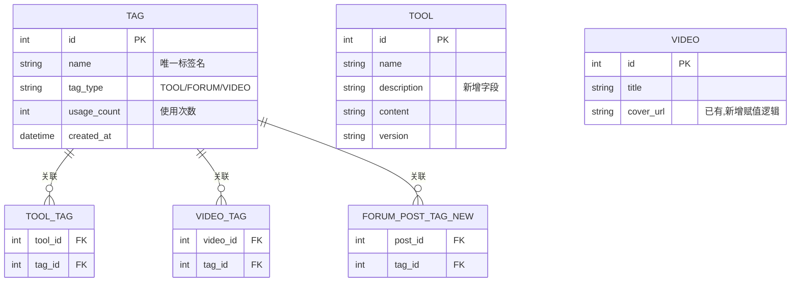

## 背景（Context）

CodingHub 是一个 AI 工具分享平台，包含三大内容模块：工具（Tool）、论坛帖子（ForumPost）、微课视频（Video）。当前存在以下体验缺口：

- **微课封面**：`Video` 实体已预留 `coverUrl` 字段（VARCHAR 500），但从未被赋值，视频列表无封面展示
- **工具描述**：`Tool` 实体仅有 `content`（Markdown 正文），缺少简短描述，卡片列表信息密度低
- **标签系统**：论坛有半成品 `ForumTag`（后端实体+API 存在，前端 UI 未接入，DTO 不返回标签），工具和微课完全没有标签

**约束条件：**
- 本地裸机部署，无 Docker/CI，文件存储于服务器本地磁盘
- 现有文件上传使用 Spring `MultipartFile`，存储路径基于 `UploadConfig.baseDir`（默认 `~/aifiles`）
- 前端使用 Vue 3 + TypeScript + Pure CSS（无 Tailwind），支持暗色/亮色双主题
- 数据库 MySQL 8.x，已有 `forum_tag` 和 `forum_post_tag` 表

## 目标 / 非目标（Goals / Non-Goals）

**目标：**
1. 微课支持封面设置：前端 Canvas 截取视频帧 + 上传封面图片
2. 工具卡片展示短描述：新增 `description` 字段，列表卡片显示摘要
3. 统一标签体系：跨模块共享 Tag 实体，工具/论坛/微课均支持标签的创建、选择、展示
4. 论坛标签补全：打通现有 ForumTag 后端到前端的完整链路

**非目标：**
- 不引入云存储（S3/OSS），维持本地文件系统存储
- 不实现标签的层级/分类树结构
- 不做标签权限控制（任何登录用户可创建标签）
- 不改造现有 MCP 工具的标签支持（MCP 接口保持现状）
- 不做视频后端截帧（仅前端 Canvas 方案）

## 决策（Decisions）

### D1: 微课封面采用前端 Canvas 截屏方案

**选择**：前端 `<video>` + `<canvas>` 截取视频帧，转为 Blob 上传

**备选方案**：
- A. 后端 JavaCV/FFmpeg 截帧：精确可控，但引入 ~100MB+ native 依赖，增加服务器 CPU 负载
- B. 前端 Canvas 截屏（选定）：零服务器开销，用户可拖拽进度条选择帧预览，体验更好
- C. 两者结合：复杂度过高，当前阶段不需要

**理由**：Canvas 截屏方案无需后端引入重量级依赖，用户体验更直观（所见即所得），后端只需处理图片上传，与现有头像上传模式一致。

### D2: 工具描述为独立纯文本字段

**选择**：在 `Tool` 实体新增 `description` VARCHAR(200) 字段，与 `content`（Markdown 正文）完全独立

**备选方案**：
- A. 从 `content` 自动截取前 N 字：简单但不可控，Markdown 格式可能截断出乱码
- B. 独立 `description` 字段（选定）：用户自由填写，卡片展示干净，不影响正文

### D3: 统一标签体系——共享 Tag 表 + 独立关联表

**选择**：一个 `tag` 表带 `tag_type` 字段（TOOL / FORUM / VIDEO）区分模块，各模块独立关联表

**备选方案**：
- A. 各模块独立标签表（3 套 Tag 实体）：代码重复，无法跨模块复用标签
- B. 完全统一（含关联表也统一）：需要多态关联（`taggable_id` + `taggable_type`），查询复杂且违反现有 `forum_post_tag` 结构
- C. 共享 Tag 表 + 独立关联表（选定）：标签元数据统一管理，关联查询简单，兼容现有 `forum_post_tag`

**理由**：标签名在平台内全局唯一（同名标签跨模块共享），但各模块的关联关系独立维护。`forum_post_tag` 已有数据不迁移，直接复用。

### D4: 论坛现有 ForumTag 迁移策略

**选择**：不迁移数据，新建统一 `tag` 表，`forum_tag` 表保留但不再使用，新的论坛帖子标签操作走新 `tag` 表（type=FORUM）

**理由**：`forum_tag` 表数据量小（项目仍在开发期），避免迁移脚本复杂度。旧表保留不影响功能，后续可手动清理。

### D5: 封面图片存储路径

**选择**：`{uploadBaseDir}/covers/{videoId}.jpg`，与视频存储模式一致

**理由**：简单直接，一个视频对应一张封面，清理时可与视频一起处理。

## 架构图

## 时序图

### 微课封面上传流程

### 标签选择流程

## 数据模型

> **注**：现有 `forum_tag` 和 `forum_post_tag` 表保留不迁移。新的统一标签关联使用新的 `forum_post_tag_new`（实际表名在实现时确定，避免与旧表冲突，或先清空旧表后复用同名）。

## 风险 / 权衡（Risks / Trade-offs）

**[风险] 旧 ForumTag 数据共存** → 新 `tag` 表（type=FORUM）与旧 `forum_tag` 表共存，可能导致数据不一致。**缓解**：实现时先检查旧表数据量，若数据少则手动迁移后删除旧表；若数据多则保留旧表只读，新操作走新表。

**[风险] Canvas 截屏的视频格式限制** → 浏览器 `<video>` 元素对视频编码有要求（如 H.264），某些编码格式的 MP4 可能无法在前端播放和截帧。**缓解**：上传时校验视频格式，前端截帧失败时提示用户手动上传封面图片作为 fallback。

**[风险] 封面图片并发覆盖** → 多用户同时修改同一视频封面可能导致文件写入冲突。**缓解**：写入时使用原子操作（先写临时文件再 rename），当前用户量下冲突概率极低。

**[权衡] 标签全局唯一 vs 模块内唯一** → 选择全局唯一（同一标签名跨模块共享），简化了标签管理但可能产生语义冲突（如 "Java" 在工具和论坛中指不同含义）。当前阶段接受此权衡，未来可按需改为模块内唯一。

## 迁移计划（Migration Plan）

1. **数据库变更**（按顺序执行）：
   - `ALTER TABLE tool ADD COLUMN description VARCHAR(200) DEFAULT NULL;`
   - `CREATE TABLE tag (id BIGINT AUTO_INCREMENT PRIMARY KEY, name VARCHAR(50) NOT NULL, tag_type VARCHAR(20) NOT NULL, usage_count INT DEFAULT 0, created_at DATETIME DEFAULT CURRENT_TIMESTAMP, UNIQUE KEY uk_name_type (name, tag_type));`
   - `CREATE TABLE tool_tag (tool_id BIGINT, tag_id BIGINT, PRIMARY KEY (tool_id, tag_id), FOREIGN KEY (tool_id) REFERENCES tool(id), FOREIGN KEY (tag_id) REFERENCES tag(id));`
   - `CREATE TABLE video_tag (video_id BIGINT, tag_id BIGINT, PRIMARY KEY (video_id, tag_id), FOREIGN KEY (video_id) REFERENCES video(id), FOREIGN KEY (tag_id) REFERENCES tag(id));`
   - 处理 `forum_post_tag`：清空旧表后复用，或新建 `forum_post_tag_v2` 关联新 tag 表

2. **后端部署**：无特殊顺序，新增字段和表不影响现有功能

3. **前端部署**：与后端同步部署

4. **回滚**：新增字段/表可直接 DROP，不影响现有数据

## 待定问题（Open Questions）

1. ~~论坛旧 `forum_tag` / `forum_post_tag` 表是否保留？~~ → 已决策：保留旧表，新操作走新 tag 表，实现时根据数据量决定是否迁移
2. 标签是否需要管理员才能创建？当前设计为任何登录用户可创建 → 维持开放创建
3. 封面图片是否需要裁剪/压缩？当前设计为原图存储 → 可后续优化，当前不限制
