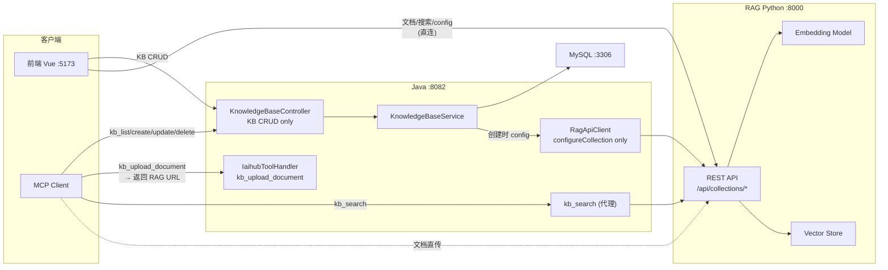
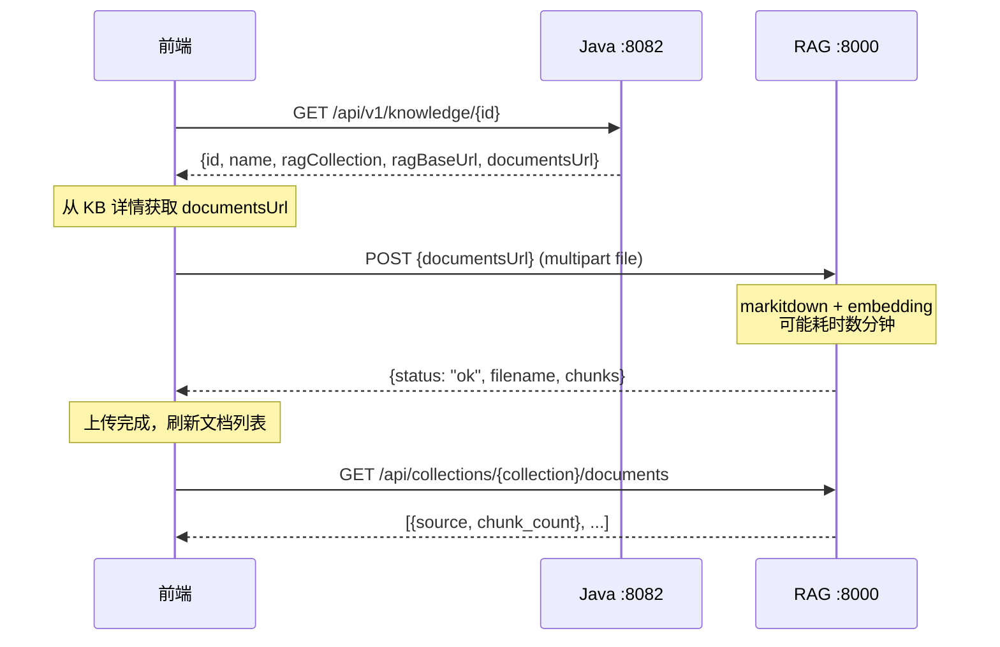
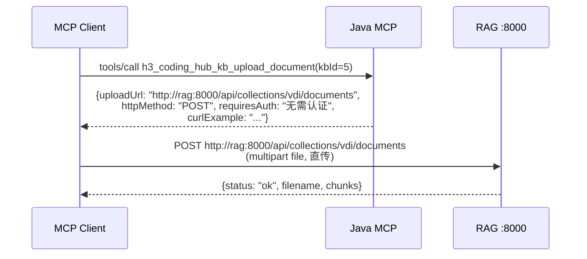

## 背景（Context）

CodingHub 知识库模块当前采用三层代理架构：前端 → Java 后端 → RAG Python 服务。文档操作（上传/列表/删除/搜索）全部经 Java 后端代理，Java 仅做 multipart 转发和 MySQL 记录。RAG 文档处理（markitdown 转换 + Qwen3-Embedding 推理）耗时可达 5 分钟/文档，导致 Java `HttpClient` 频繁超时。

**现状约束：**
- RAG Python 服务已有完整的文档 REST API（`/api/collections/{name}/documents`），无认证
- Java `RagApiClient` 的 `uploadDocument` 超时已从 300s 增至 900s 仍不够用
- MySQL `kb_document` 表记录文档元数据（上传者、时间、chunk 数），但实际使用率低
- MCP `kb_upload_document` 工具已采用"返回上传接口信息"模式（非二进制直传）

## 目标 / 非目标（Goals / Non-Goals）

**目标：**
- 前端和 MCP 客户端直连 RAG Python 服务进行文档操作，消除 Java 代理层
- Java 后端仅保留 KB 元数据管理（CRUD）和搜索代理
- KbResponse 返回 RAG 服务地址，客户端自发现文档 API 端点
- MCP `kb_upload_document` 返回 RAG 直传地址

**非目标：**
- 不修改 RAG Python 服务本身（其 REST API 已完整）
- 不实现文档级权限（内部系统，接受风险）
- 不删除 MySQL `kb_document` 表（向后兼容，保留历史数据）
- 不修改 `kb_search` 的代理模式（搜索为秒级响应，无超时问题）

## 决策（Decisions）

### 决策 1：文档元数据策略 — 不再写 MySQL

**选择：方案 A — 不写 MySQL**

备选方案：
- A) 前端直传 RAG，不再在 MySQL 记录文档 → 选中：最简单，文档列表直接查 RAG
- B) 前端上传完 RAG 后回调 Java 注册 → 拒绝：增加前端复杂度和两次请求
- C) Java 后台定时同步 RAG 文档列表 → 拒绝：最终一致有延迟，增加维护成本

理由：`kb_document` 表的实际使用率很低（仅用于列表展示），RAG 的 `GET /api/collections/{name}/documents` 已返回文档列表和 chunk 数。丢失的元数据（上传者、上传时间）对当前产品无实际价值。

### 决策 2：RAG 地址传递方式 — KbResponse 内嵌

**选择：KbResponse 新增 ragBaseUrl + documentsUrl 字段**

备选方案：
- A) 前端硬编码 RAG 地址 → 拒绝：不可移植，环境切换需改代码
- B) KbResponse 返回 ragBaseUrl + 拼接好的 documentsUrl → 选中：Java 知道 RAG 地址（`app.rag.base-url`），客户端直接用
- C) 独立的 `/api/v1/rag-config` 端点 → 拒绝：多余一跳，KB 详情已包含足够信息

### 决策 3：kb_search 保持 Java 代理

**选择：保留现状**

理由：搜索响应为秒级（无 embedding 计算），不存在超时问题。保留 Java 代理便于未来加缓存/日志/限流。MCP 客户端只需连一个地址做搜索。

### 决策 4：KB Config 操作走直连

**选择：前端 getConfig/updateConfig 也改为直连 RAG**

理由：Config 操作也是直接对 RAG 的，Java 代理同样没有附加价值。保持架构一致性（文档相关操作全部直连）。

## 架构图

## 时序图

### 文档上传流程（新）

### MCP 文档上传流程（新）

## 风险 / 权衡（Risks / Trade-offs）

- **[文档元数据丢失]** → MySQL `kb_document` 不再写入，丢失上传者/上传时间。缓解：当前产品不需要这些元数据；RAG 返回的文档列表包含 source 和 chunk_count，足以满足展示需求。
- **[RAG 地址暴露]** → 前端和 MCP 客户端需要知道 RAG 地址。缓解：通过 KbResponse 动态返回，不硬编码；本地部署场景下 RAG 与后端同机，无额外网络风险。
- **[无文档权限]** → 任何知道 collection 名称的人可上传/删除文档。缓解：内部系统使用，知识库 URL 不公开暴露。
- **[RAG 服务不可用]** → 前端直连 RAG 时，RAG 宕机导致文档操作全部失败。缓解：与当前架构一致（Java 代理也无法在 RAG 宕机时完成操作）；KB 管理（CRUD）不受影响。
- **[CORS]** → 前端直连 RAG 需跨域。缓解：RAG 已配置 CORS 中间件（`allow_origins=["*"]`）。

## 迁移计划（Migration Plan）

1. **Java 后端**：删除文档代理端点和相关代码 → KbResponse 加字段 → 重启
2. **前端**：knowledge.ts 改请求目标 → KnowledgeDetailPage 适配 → 重新构建
3. **MCP**：IaihubToolHandler 改 kb_upload_document 返回内容 → 重启
4. **回滚策略**：Java 代码通过 Git revert 恢复文档代理端点；前端通过 Git revert 恢复 service 层

## 待定问题（Open Questions）

- 前端是否需要显示 RAG 连接状态指示器？（当前不计划实现）
