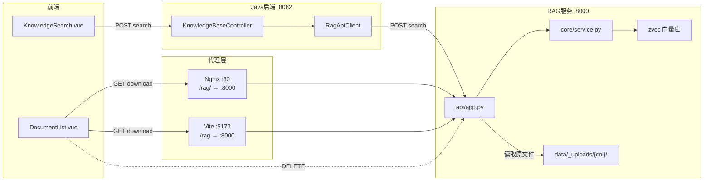
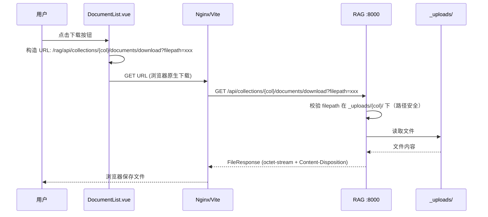
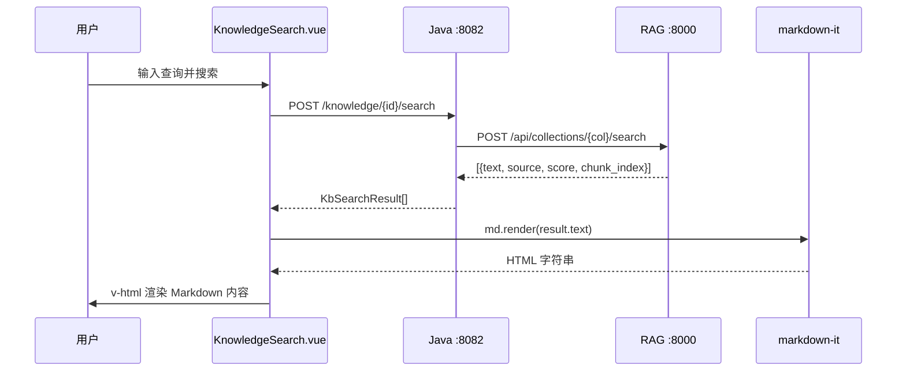

## 背景（Context）

知识库（KB）模块采用直连 RAG 架构：前端通过 Nginx `/rag/` 代理直接调用 RAG 服务（`:8000`），KB CRUD 和搜索则经 Java 后端（`:8082`）代理。当前搜索页面用 `<p>{{ result.text }}</p>` 纯文本渲染，文档列表仅有查看和删除操作。

现有 `PostContent.vue` 已实现完整的 Markdown 渲染能力（markdown-it + highlight.js + mermaid），但未抽取为通用组件。RAG 上传的二进制文件（PDF/DOCX/PPTX/XLSX）保存在 `data/_uploads/{collection}/` 下，文本文件（.md/.py/.txt 等）仅将内容存入向量库，未保留原文件。

## 目标 / 非目标（Goals / Non-Goals）

**目标：**

- 搜索结果以 Markdown 格式渲染，支持标题、列表、代码块高亮、表格等常见格式
- 文档列表支持所有类型文件（含文本和二进制）的源文件下载
- 本地 `npm run dev` 开发环境可正常使用所有 KB 功能（含下载）

**非目标：**

- MCP 工具不需要支持文件下载
- 不抽取通用 MarkdownRenderer 组件（当前仅在搜索页面使用，PostContent 保持不动）
- 不支持文档预览（仅下载）
- 不处理大文件流式下载（知识库文档通常在几十 MB 以内）

## 决策（Decisions）

### D1: 搜索结果的 Markdown 渲染方式

**选择**：在 `KnowledgeSearch.vue` 内创建轻量级 markdown-it 实例，不抽取通用组件。

**备选方案：**
- **方案 A（选中）**：搜索组件内独立 markdown-it 实例，`html: false`，启用 highlight.js 代码高亮
- **方案 B**：抽取 `MarkdownRenderer.vue` 通用组件，搜索和论坛共用
- **方案 C**：直接复用 `PostContent.vue` 组件

**理由**：方案 C 过重（PostContent 含 mermaid 渲染、链接处理等搜索场景不需要的能力），方案 B 需要重构现有 PostContent 影响面大。方案 A 改动最小，搜索场景的 Markdown 需求简单（不需要 mermaid），独立实例避免耦合。`html: false` 防止 XSS（搜索结果来自用户文档，可能含恶意 HTML）。

### D2: RAG 下载 API 设计

**选择**：`GET /api/collections/{name}/documents/download?filepath=xxx`

**备选方案：**
- **方案 A（选中）**：filepath 作为 query param，与删除操作（DELETE + body filepath）保持风格一致
- **方案 B**：`GET /api/collections/{name}/documents/{filename}/download`，用路径参数

**理由**：filepath 包含完整路径如 `data/_uploads/kb-1/技术指南.md`，用 query param 更灵活，且与现有 deleteDocument 的 filepath 参数模式一致。

### D3: 文本文件原文件保存策略

**选择**：修改 `ingest_content` 在分块前将文本内容写入 `_uploads/` 目录。

**备选方案：**
- **方案 A（选中）**：所有文件类型统一保存原文件
- **方案 B**：仅支持二进制文件下载，文本文件显示"不支持下载"提示

**理由**：方案 A 用户体验一致，改动极小（加两行代码），磁盘开销可忽略（文本文件通常很小）。

### D4: 前端下载触发方式

**选择**：构造完整 URL 后用 `<a>` 标签 + `download` 属性触发浏览器原生下载。

**理由**：最简单可靠，无需 axios 或 blob 处理。下载 URL 走 Nginx/Vite proxy，与文档上传/删除一致。

## 架构图



## 时序图

### 文档下载流程



### 搜索结果 Markdown 渲染流程



## 风险 / 权衡（Risks / Trade-offs）

- **[不完整 Markdown chunk]** → 搜索返回的 chunk 可能在代码块中间截断，导致 markdown-it 渲染出不完整的 HTML。缓解：markdown-it 对不完整语法容错性好，偶尔的渲染瑕疵可接受。如后续问题严重，可加预处理补全未闭合的 ``` 标记。
- **[路径遍历攻击]** → filepath 参数可能被构造恶意路径如 `../../etc/passwd`。缓解：下载 endpoint 校验 filepath 必须在 `_uploads/{collection}/` 目录下（`os.path.realpath` + `startswith` 检查）。
- **[磁盘空间增长]** → 文本文件也保存到 `_uploads/` 增加了磁盘占用。缓解：文本文件通常很小（KB~MB 级别），可忽略。删除文档时已实现清理逻辑。
- **[已有文本文件无法下载]** → 改动后新上传的文本文件可下载，但历史文本文件因未保存原文件而无法下载。缓解：在 UI 上对文件不存在的情况做友好提示，用户重新上传即可。

## 迁移计划（Migration Plan）

无数据库迁移。部署步骤：

1. 先部署 RAG 服务（新增下载 endpoint + ingest_content 保存文本文件）
2. 再部署前端（搜索 Markdown 渲染 + 文档下载按钮 + Vite proxy 修复）
3. 后端 `application.yml` 的 `base-url` 按需改为 `localhost:8000`（本地开发）或保持远程地址（生产环境）

回滚：各组件独立，可分别回滚，无互相依赖。
