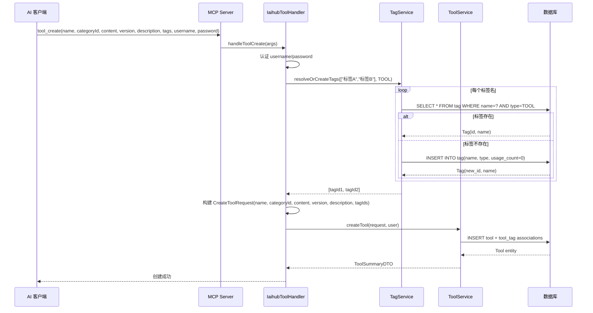

## 背景（Context）

CodingHub 工具广场当前存在 4 个分散的问题：

1. **EditToolPage.vue** 第 55-59 行 `if (tool.uploaderId !== authStore.user?.id)` 硬编码只允许工具所有者进入编辑页，管理员被拦截重定向到首页。后端 `ToolService.updateTool()` 已正确支持 `isOwner || isAdmin`，但前端未对齐。
2. **HomePage.vue** 快捷上传弹窗（Teleport 模态框）的 `uploadForm` 对象缺少 `description` 和 `tagIds` 字段，而独立的 `UploadPage.vue` 已包含这些字段。
3. 工具广场卡片的 `.tool-name` 区域仅展示工具名称，`ToolSummaryDTO` 中的 `version` 字段未渲染。
4. MCP Server 的 `h3_coding_hub_tool_create` 和 `h3_coding_hub_tool_modify` 工具方法缺少 `description` 和 `tags` 参数。`IaihubToolHandler` 构建 `CreateToolRequest` 时只设置了 name/categoryId/content/version。

约束：本次变更均为小幅修改，不涉及数据库 schema 变更、新外部依赖或架构调整。

## 目标 / 非目标（Goals / Non-Goals）

**目标：**

- 管理员（ADMIN/SUPER_ADMIN）可进入任意工具的编辑页面修改工具信息
- HomePage 快捷上传弹窗与独立 UploadPage 表单字段一致（至少包含简短描述）
- 工具广场卡片在名称后以 badge 形式展示版本号
- MCP 创建/修改工具方法接受 `description` 和 `tags`（标签名列表）参数
- 后端按标签名自动匹配已有标签 ID，不存在的标签自动创建并关联

**非目标：**

- 不重构 MCP 认证机制（仍使用 username/password 参数）
- 不修改后端 Tool 实体或数据库 schema
- 不添加新的前端路由或页面
- 不改变 ToolDetailPage 的布局和样式

## 决策（Decisions）

### D1: EditToolPage 权限检查策略

**决策**：修改 `fetchTool()` 中的条件判断，从 `uploaderId !== userId` 改为 `uploaderId !== userId && !isAdmin`。

**备选方案**：
- A) 新增独立的管理员编辑路由 `/admin/tools/:id/edit` → 代码重复，维护成本高
- B) 后端返回权限标志，前端按标志判断 → 过度设计，前端已有 `authStore.isAdmin`

**选择理由**：最小改动，与后端权限模型对齐，与 DetailPage 的 `canModify` 逻辑保持一致。

### D2: MCP tags 参数设计

**决策**：MCP 接口接受 `tags` 字符串列表（标签名），后端新增 `TagService.resolveOrCreateTags(List<String> names, TagType type)` 方法，按名称查找已有标签或创建新标签，返回标签 ID 列表。

**备选方案**：
- A) 接受 `tagIds` 列表 → AI 客户端不知道标签 ID，不友好
- B) 接受 `tags` 字符串但只匹配不创建 → 新标签需手动预创建，限制自动化

**选择理由**：标签名比 ID 更语义化，自动创建符合 MCP 自动化场景的需求。与现有 `TagService` 的 `createTag` 方法复用。

### D3: 版本号展示位置

**决策**：版本号以 `v{version}` 形式内联在 `.tool-name` 之后，使用青色（accent-2）badge 样式，`font-family: var(--font-mono)`。

**备选方案**：
- A) 版本号放在卡片底部统计栏 → 信息层级不直观
- B) 版本号作为独立行显示 → 占用过多垂直空间

**选择理由**：内联 badge 紧凑直观，与名称关联性强，与已有的 pinned/hot badge 视觉风格一致。

## 时序图

MCP 创建工具时标签自动解析流程：

## 风险 / 权衡（Risks / Trade-offs）

- **[标签并发创建]** → 两个 MCP 请求同时创建同名标签可能产生重复。缓解：`tag` 表已有 `UNIQUE(name, type)` 约束，捕获 `DataIntegrityViolationException` 后回退查询。
- **[管理员越权编辑]** → 管理员可编辑任意工具，存在滥用风险。缓解：后端已有 `@PreAuthorize` 注解保护，且 EditToolPage 的提交走相同的 `PUT /api/v1/tools/{id}` 端点，服务端二次验证权限。
- **[版本号 badge 截断]** → 超长版本号可能撑破布局。缓解：设置 `max-width: 120px` + `text-overflow: ellipsis`。

## 待定问题（Open Questions）

- HomePage 快捷上传弹窗是否也需要增加 `tagIds`（标签选择器）？当前仅增加简短描述。暂不添加，保持弹窗轻量，完整功能引导至独立 UploadPage。
