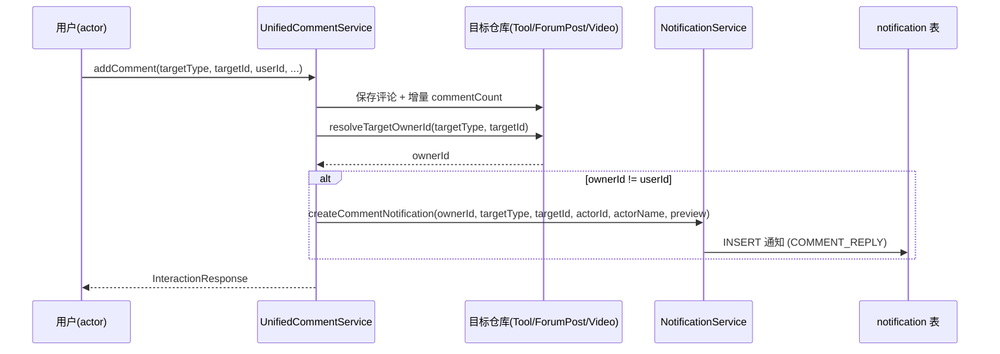
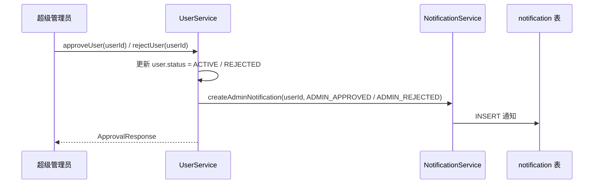

## 背景（Context）

消息中心为双主题 UI 的通知聚合面板，后端由 `NotificationController`（`/api/v1/notifications`）+ `NotificationService` + `NotificationRepository` 支撑，`notification` 表已通过 Flyway 初始化（`V7__add_notification_danmaku_bio.sql`）。读取、未读计数、标记已读链路完整可用。

问题在「写入」侧：`NotificationService` 内部已定义 `createCommentNotification(ownerId, targetType, targetId, actorId, actorName, preview)`、`createLikeNotification(ownerId, targetType, targetId, actorId, actorName)`、`createAdminNotification(userId, type)` 三个方法，且自带「不通知自己 / 目标用户不存在则返回」的 null 守卫，但**全后端无任何调用点**，导致消息中心永远为空。

本设计的目标是把这三个方法接入真实业务事件，使消息中心产生内容。

## 目标 / 非目标（Goals / Non-Goals）

**目标：**
- 评论、点赞（仅登录用户、仅他人内容）触发对应通知。
- 注册审批通过 / 拒绝触发管理员通知。
- 前端图标 / 颜色与后端枚举一致。

**非目标：**
- 不新增通知类型、不改 `notification` 表结构、不引入实时推送（WebSocket/SSE），保持现有 30s 轮询。
- 不为匿名用户生成通知（匿名无身份、无法对应 actor）。
- 不做通知聚合 / 分组 / 批量清理等增强。

## 决策（Decisions）

- **D1：统一服务单一注入点**。评论通知在 `UnifiedCommentService.addComment`、点赞通知在 `UnifiedLikeService.toggleLike` 注入 `NotificationService`。这两个统一服务已按 `TargetType` 覆盖 TOOL / FORUM_POST / VIDEO 三种域，一处接入即可覆盖全部模块，避免在各域服务（Tool/Forum/Video）重复 3× 接线。
  - 备选：在 `ToolLikeService` / `ForumCommentService` 等各域服务分别接入 → 拒绝，重复度高、易遗漏。
- **D2：最佳努力副作用，调用点 try-catch**。通知失败绝不能导致评论 / 点赞 / 审批主流程失败。在三个调用点用 `try { notificationService.xxx(...) } catch (Exception e) { log.warn(...) }` 包裹（也可在 `NotificationService` 内部吞异常，但调用点包裹更直观、可观测）。
- **D3：仅登录用户、不通知自己**。匿名评论 / 点赞（无 `userId`）不触发通知；`createCommentNotification/createLikeNotification` 内部已 `if (targetOwnerId.equals(actorId)) return` 屏蔽自己，调用点额外判断 `userId != null` 避免匿名噪声。
- **D4：复用仓库解析目标所有者**。新增私有辅助方法 `resolveTargetOwnerId(TargetType, targetId)`：TOOL→`toolRepository`，FORUM_POST→`forumPostRepository`，VIDEO→`videoRepository`，返回其 `userId`（所有者）。目标不存在时复用既有 `validateTargetExists` 已保证存在，故解析为空直接跳过通知。
- **D5：actorName 取值**。评论用登录用户 `nickname`（与 `addComment` 已解析的 `userNickname` 一致）；点赞用同一来源。匿名场景已被 D3 排除。
- **D6：前端枚举对齐**。将 `NotificationBell.vue` 的 `getNotificationIcon` / `getNotificationIconColor` 改为匹配 `LIKE` / `COMMENT_REPLY` / `ADMIN_APPROVED` / `ADMIN_REJECTED`；`COMMENT_REPLY` 复用 `MessageCircle`，`ADMIN_APPROVED`/`ADMIN_REJECTED` 复用 `User` 图标（管理类），移除后端不存在的 `FAVORITE`/`FOLLOW` 分支。

## 时序图

## 风险 / 权衡（Risks / Trade-offs）

- [通知与主流程同事务] → 若主事务回滚，通知也回滚（同一 DataSource），数据一致；若需「主流程成功但通知可失败独立」，可改为 `@Transactional(propagation=REQUIRES_NEW)`，本期不引入，保持简单。
- [测试构造参数变更] → 三个服务新增 `NotificationService` 构造参数，既有 `new XService(...)` 测试编译失败；需在测试中补 `@Mock NotificationService` 并传入构造调用（见 tasks / impact-analysis）。
- [评论回复链通知粒度] → 嵌套回复只通知「目标资源所有者」，不逐层通知每个父评论作者；本期按「资源所有者」维度通知，避免刷屏。

## 迁移计划（Migration Plan）

- 无数据库迁移（表与枚举已存在）。
- 部署为纯后端逻辑增量 + 前端枚举修正，向后兼容，可灰度发布。
- 回滚：直接 revert 相关提交即可，不影响历史数据。

## 待定问题（Open Questions）

- 无（设计范围明确，无需额外决策）。
