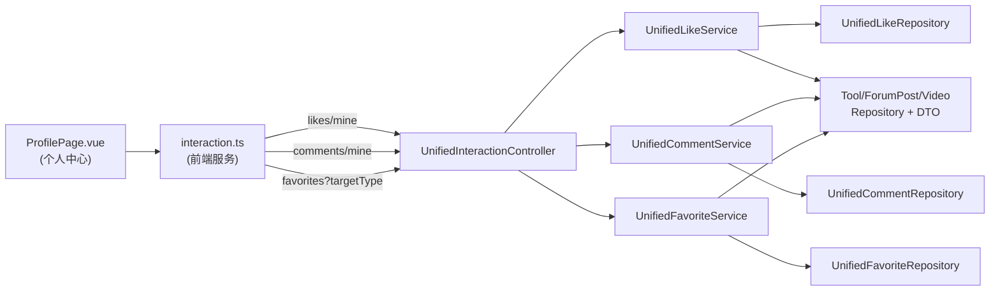
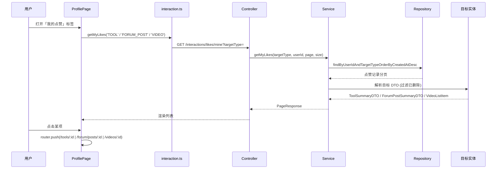

## 背景（Context）

项目已有一套统一互动模型，所有模块（TOOL / FORUM_POST / VIDEO）的评论、点赞、收藏均通过 `unified_comment` / `unified_like` / `unified_favorite` 三张表多态存储，并由 `UnifiedInteractionController`（`/api/v1/interactions/...`）统一暴露。

现状：
- **收藏**：`GET /api/v1/interactions/favorites?targetType=` 已支持「按用户 + 类型」分页查询，并直接返回目标的完整 DTO（`ToolSummaryDTO` / `ForumPostSummaryDTO` / `VideoListItem`），已在前端模块级页面（`/forum/my-favorites`、`/videos/my-favorites`）使用。
- **点赞 / 评论**：目前仅支持「按目标」查询（`getLikeStatus`、`getComments`），**没有按用户查询的接口**；对应的 `UnifiedLikeRepository`、`UnifiedCommentRepository` 也缺少 `findByUserId` 方法。
- **个人中心**：`ProfilePage.vue` 现有头像管理、编辑资料、修改密码三块，没有互动聚合展示。

约束：继承既有 `TargetType` 枚举、JWT 鉴权、`XssSanitizer` 过滤、软删除过滤（只返回 `status=Normal`/`NORMAL` 的目标）。本变更为纯增量，不改动任何「按目标」接口行为。

> 注：未查询到项目 LLM Wiki 历史上下文，设计依据为源码现状与既有 `UnifiedFavoriteService` 实现模式。

## 目标 / 非目标（Goals / Non-Goals）

**目标：**
- 在个人中心新增「我的评论 / 我的收藏 / 我的点赞」三块聚合展示（标签页形式内嵌）。
- 三个板块各自按三种 `targetType` 拉取最近 N 条（默认 10），提供「查看全部」展开。
- 每条互动可点击跳转至对应详情页。
- 后端补齐「我的点赞」「我的评论」两个按用户查询接口，复用收藏的 DTO 构建与软删除过滤逻辑。

**非目标：**
- 不做评论锚点定位（点击仅跳详情页，不滚动到具体评论）。
- 不新增统一「我的互动」独立路由页（仅内嵌于 ProfilePage）。
- 不改动匿名互动的存储与查询逻辑。
- 不改动现有模块级收藏页（`/forum/my-favorites`、`/videos/my-favorites`）。

## 决策（Decisions）

1. **渲染位置：内嵌标签页于 ProfilePage（而非新建页面）**
   - 备选 A（采纳）：直接在 `ProfilePage.vue` 内以标签页切换三块内容，最贴合「在个人中心增加」的需求，改动集中、易维护。
   - **入口说明**：用户从全局导航栏 `AppHeader` 右上角的「用户头像 + 用户名」触发下拉菜单，点击「个人资料」项（`goToProfile()`）经路由 `/me/profile` 进入 `ProfilePage`；未登录时顶部仅显示「登录 / 注册」，不会出现用户菜单。互动数据即展示在 `ProfilePage` 内的「我的互动」板块，详见 `ui-preview.html` 的「如何进入此页面」入口流。
   - 备选 B：ProfilePage 仅放入口，跳转到新建统一「我的互动」页 —— 增加路由与页面，收益不明显。
   - 备选 C：复用现有模块页、ProfilePage 仅放链接 —— 评论/点赞无对应模块页，无法统一。

2. **后端新增接口镜像收藏实现（而非另起炉灶）**
   - 「我的点赞」`GET /interactions/likes/mine?targetType=` 与「我的评论」`GET /interactions/comments/mine` 复刻 `UnifiedFavoriteService.getMyFavorites` 的分页 + 目标 DTO 构建 + 软删除过滤模式，降低认知成本与出错面。
   - 点赞/收藏的返回结构**直接复用** `ToolSummaryDTO` / `ForumPostSummaryDTO` / `VideoListItem`，无需新 DTO。

3. **「我的评论」返回目标标题**
   - 评论本身只存 `targetType` + `targetId`，展示需要「这条评论属于哪个工具/帖子/视频」。后端在 `getMyComments` 中按类型解析目标标题（tool.name / forumPost.title / video.title），返回轻量 DTO：`{ id, targetType, targetId, targetTitle, content, createdAt }`，前端无需二次请求。

4. **仅统计登录用户（userId）数据**
   - 匿名点赞以 `ip_hash` 存储、无用户归属，天然不属于「我的」。两个新接口强制要求登录（401），与收藏一致。

5. **每种类型分别调用收藏接口**
   - 收藏接口按 `targetType` 分别查询，个人中心内「我的收藏」对三种类型各调用一次（或后续可扩展为不传类型返回全部）。本期采用三次调用，逻辑简单清晰。

## 架构图

## 时序图

## 风险 / 权衡（Risks / Trade-offs）

- [风险] 评论/点赞的目标可能已被软删除 → 复用收藏的「仅返回 NORMAL 目标」过滤，跳过已删除项，避免死链。
- [风险] 三种类型分别调用收藏接口，个人中心首屏最多 1（评论）+ 3（收藏）+ 3（点赞）= 7 个并发请求 → 点赞/收藏可并行触发；评论仅一个请求。数据量小（默认每类 10 条），性能可接受；如需优化可后续合并为批量接口。
- [风险] 评论内容含 XSS → 展示层复用既有 `XssSanitizer` 存储过滤，前端以 `v-text` / 文本插值渲染，不再做额外处理。
- [权衡] 不做评论锚点定位，跳转后用户需自行在详情页找到评论 —— 本期范围取舍，后续可增强。

## 迁移计划（Migration Plan）

无数据库表结构变更，无数据迁移。仅新增只读查询接口与前端展示，回滚只需撤销前后端代码，不影响存量数据。

## 待定问题（Open Questions）

- 无。渲染位置、范围、跳转方式已在提案阶段按推荐方案确定。
