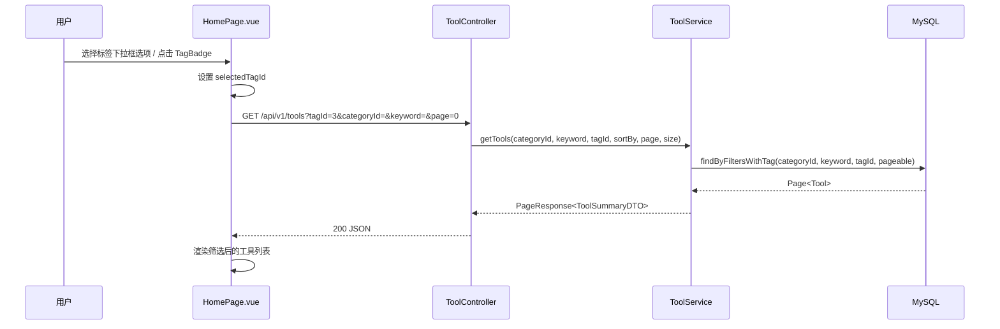
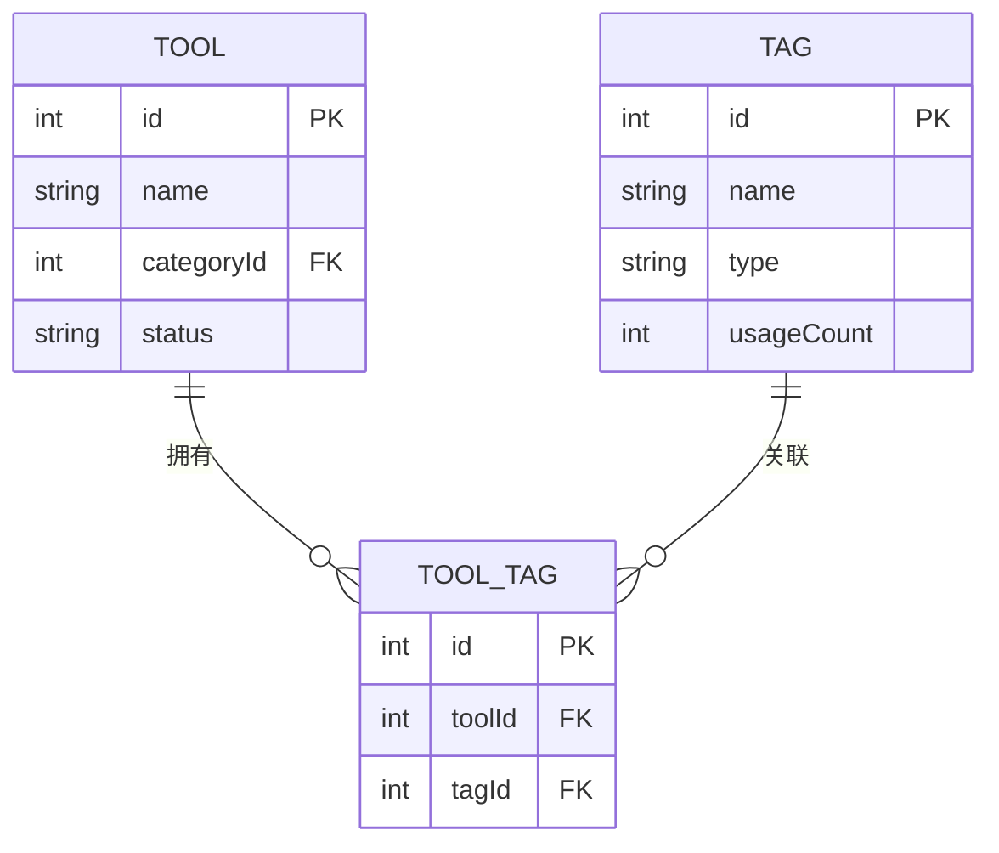

## 背景（Context）

工具广场首页（`HomePage.vue`）当前支持按分类（`categoryId`）和关键词（`keyword`）筛选工具，后端通过 `ToolRepository.findByFilters(categoryId, keyword, pageable)` 实现。统一标签体系已上线：`tag` 表存储标签、`tool_tag` 关联表建立工具与标签的多对多关系，工具卡片已展示 TagBadge。但缺少"按标签筛选"的查询路径——`ToolTagRepository` 仅有 `findByToolId` 正向查询，无反向查询（按 tagId 找 toolIds）。

前端 Wiki 文档提及"标签过滤"能力，但实际未实现。MCP 模块已有批量标签解析逻辑（`resolveTagsForTools`），可复用其模式。

## 目标 / 非目标（Goals / Non-Goals）

**目标：**

- `GET /api/v1/tools` 支持可选 `tagId` 参数，返回关联该标签的工具分页列表
- 前端工具广场筛选栏增加标签选择器，选中后触发筛选
- 工具卡片 TagBadge 可点击，点击后筛选该标签
- 与现有 categoryId、keyword 筛选可叠加使用

**非目标：**

- 不支持多标签 AND/OR 组合筛选（本期仅单标签）
- 不改动标签管理（CRUD）逻辑
- 不改动 MCP 工具搜索接口
- 不引入全文搜索引擎

## 决策（Decisions）

### D1: 标签筛选的查询策略

**选择：子查询方案** — 在 `ToolRepository` 的 JPQL 中增加 `EXISTS (SELECT 1 FROM ToolTag tt WHERE tt.toolId = t.id AND tt.tagId = :tagId)` 条件。

备选方案：
- A) 两步查询：先查 `tool_tag` 拿 toolIds，再 `WHERE id IN (:ids)` — 当工具量大时 IN 列表过长，分页需额外处理
- B) JOIN 查询：`JOIN ToolTag tt ON tt.toolId = t.id WHERE tt.tagId = :tagId` — 可行但会改变现有查询结构，需为每种排序写 JOIN 变体
- C) EXISTS 子查询（选定）：对现有 `findByFilters` 系列方法增加可选条件，利用 Spring Data JPA 的 `@Query` 动态拼接或新增方法重载

选 C 的理由：不改变现有查询结构，仅在 WHERE 中追加一个 EXISTS 条件，对无 tagId 的调用零影响。`tool_tag` 表数据量小（工具数 × 平均标签数），EXISTS 性能足够。

### D2: 前端标签选择器交互

**选择：搜索栏旁的下拉选择框** — 在搜索输入框右侧增加一个下拉选择框，收起时显示"标签: 全部标签"（选中时显示"标签: {标签名}"），点击展开为 radio 样式的单选列表，数据来自 `GET /api/v1/tags?type=TOOL`（已有接口）。选择"全部标签"或再次点击当前选中项即取消筛选。

备选方案：
- A) 横向标签 Pills 行 — 占用纵向空间，标签多时需滚动
- B) 侧边栏标签面板 — 布局改动大
- C) 下拉选择框（选定）— 与搜索栏同行，不增加页面高度，单选语义清晰，收起状态不干扰浏览

### D3: TagBadge 点击行为

**选择：在工具广场上下文中，TagBadge 点击触发标签筛选（emit 事件到 HomePage）。** 在详情页等其他场景中保持纯展示不变。通过 props 控制是否可点击（`clickable` prop）。

### D4: MCP 工具搜索的标签参数

**选择：`h3_coding_hub_tool_search` 新增可选参数 `tag`（String，标签名称）。** `McpSearchService.searchTools()` 在现有查询结果上按标签名称过滤（复用已有的 `resolveTagsForTools` 批量标签解析，内存过滤匹配）。

备选方案：
- A) 传 tagId（数字）— MCP 客户端（AI agent）通常知道标签名称而非 ID，传名称更自然
- B) 数据库层 JOIN 过滤 — MCP 搜索量小（limit 默认 200，工具数百级），内存过滤足够，无需新增 Repository 方法
- C) 标签名称内存过滤（选定）— 零新增查询，复用已有标签解析逻辑，实现最简

选 C 的理由：MCP 搜索本身已批量解析每个工具的标签（`resolveTagsForTools`），过滤只需在 stream 中加一个 name 匹配条件。标签名称匹配忽略大小写。当 `tag` 参数存在时，先按较大 limit 取候选集再过滤，确保结果数量合理。

## 时序图

## 数据模型

无 schema 变更。复用现有表：

## 风险 / 权衡（Risks / Trade-offs）

- [单标签限制] 用户可能期望多标签组合筛选 → 本期先做单标签，API 设计预留 `tagId` 为单值参数，后续可扩展为 `tagIds` 数组
- [标签数量增长] 标签过多时下拉列表过长 → 当前标签 < 20 个，下拉列表可完整展示；后续可加分组或搜索
- [EXISTS 性能] 工具量极大时子查询可能变慢 → `tool_tag` 表已有 `toolId` 索引，加 `tagId` 索引即可；当前数据量（百级工具）完全无压力

## 待定问题（Open Questions）

（无）
