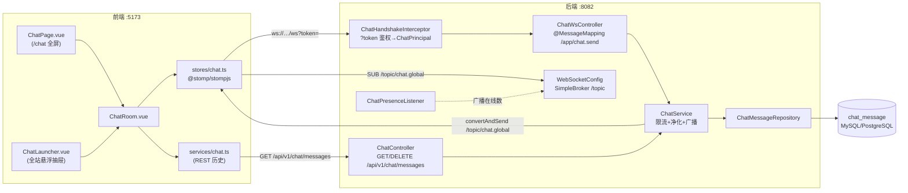
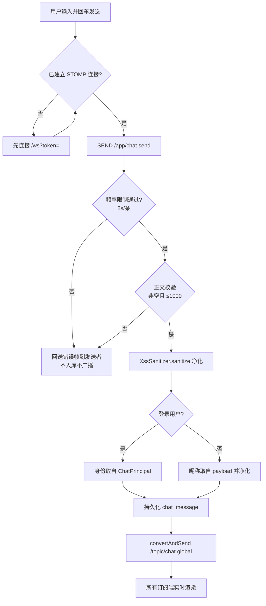
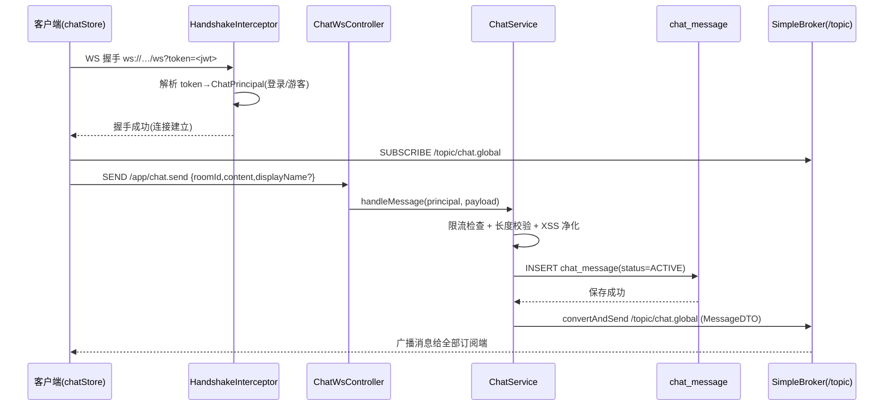
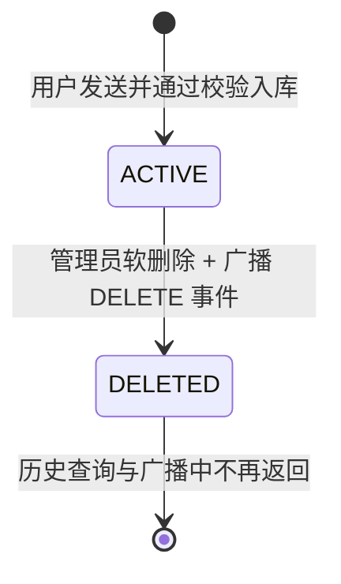
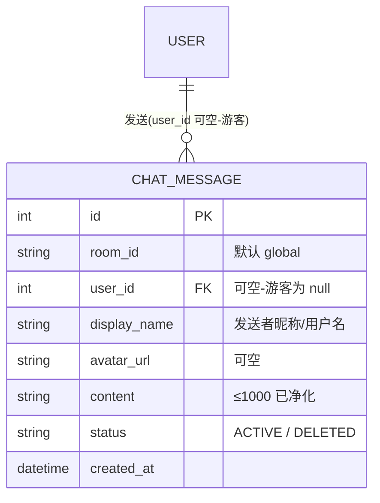

## 背景（Context）

CodingHub 现有社区能力均为异步 REST 模型：论坛帖子/评论、微课弹幕、工具评论等。点赞/评论/收藏已统一收敛到 `UnifiedInteraction`（`UnifiedLike`/`UnifiedComment`/`UnifiedFavorite`），并有明确约定"互动能力必须复用统一实现，禁止重复造轮子"。本次新增的是**实时聊天**，与既有异步互动在传输模型（WebSocket 推送 vs REST 拉取）、数据归属（无目标实体的消息流 vs 绑定 TOOL/FORUM_POST/VIDEO 的评论）、生命周期（在线广播 vs 持久列表）上均不同。

**LLM Wiki 历史上下文（已查询）：**
- `note: 评论/收藏/点赞必须复用统一互动`——本设计据此明确区分：聊天**不属于**该类互动，但会**复用**其成熟做法（游客 IP 哈希 `computeIpHash`、`XssSanitizer`、软删除 `status` 枚举、`JwtUtil` 解析）。
- `note: UI 预览/设计稿必须包含页面入口与导航路径`——前端设计明确交代 `/chat` 全屏页与全站悬浮抽屉两个入口的进入路径。
- `模块: 用户与认证`——现有 `JwtAuthenticationFilter` 从 `Authorization` 头取 token；WebSocket 握手无法带自定义头，故改用握手查询参数 `?token=`。

**约束：** Java 17 / Spring Boot 3.2.5；`ddl-auto: update` 自动建表（MySQL/PostgreSQL 双库，方言自动探测）；后端分层 `controller → service → repository → model` 单向依赖；本地单实例部署，无 Redis、无 Docker。

## 目标 / 非目标（Goals / Non-Goals）

**目标：**
- 提供一个全局公共聊天室，登录用户与游客均可实时收发消息
- 消息持久化，进房加载最近 50 条历史
- 实时在线人数、发言频率限制、管理员软删除
- 前端双入口（全屏页 + 悬浮抽屉）复用同一聊天组件与 store
- 暗/亮双主题适配
- 保留多房间（`room_id`）与分布式广播（Redis）的扩展点

**非目标：**
- 私聊 / 一对一会话、多房间 UI、@提及、消息撤回/编辑
- 图片、文件、表情包等富媒体消息
- 多实例横向扩展（Redis STOMP relay）——阶段 0 单实例 SimpleBroker
- 接入 notification 模块的未读推送（未读角标仅前端本地维护）
- 历史消息分页/无限上拉（阶段 0 仅拉最近 50 条）

## 决策（Decisions）

**D1：独立建模 `chat_message`，不复用 `UnifiedComment`。**
备选：复用统一互动的 `UnifiedComment` + 新增 `TargetType.CHAT`。否决原因——`UnifiedComment` 强绑定目标内容实体且为 REST 拉取模型，聊天是无目标实体的实时消息流，二者生命周期、索引、广播需求不同；强行复用会污染统一互动语义。折中：复用其**做法**（IP 哈希、XSS、软删除、JWT），而非其**表结构**。

**D2：WebSocket + STOMP + `SimpleBroker`，不引 Redis、不用 SockJS。**
备选：原生 WebSocket handler / SockJS 降级 / Redis relay。否决原因——阶段 0 单实例，SimpleBroker 足够；STOMP 提供订阅/目的地/心跳等开箱能力，前端 `@stomp/stompjs` 成熟；现代浏览器普遍支持 WebSocket，SockJS 降级增加复杂度收益低。扩展点：消息统一经 `ChatService` 广播，未来切 Redis relay 只改 broker 配置。

**D3：握手期鉴权用查询参数 `?token=<jwt>`，登录可选。**
备选：STOMP CONNECT 帧 header 带 token。否决原因——查询参数在握手阶段即可拿到，便于在 `HandshakeInterceptor` 构造 `Principal` 并区分登录/游客。无 token 或 token 无效 → 视为游客（不拒绝连接），游客发言必须提供 `displayName`。

**D4：`ChatPrincipal` 承载会话身份。**
在握手拦截器中构造 `ChatPrincipal{ userId(可空), displayName, avatarUrl(可空), ipHash, admin, sessionId }` 并放入 WebSocket 会话属性/Principal。登录用户 `displayName`/`avatarUrl` 取自 `User`，忽略客户端传值；游客取客户端 `displayName`（净化后）。

**D5：频率限制在 `ChatService` 内存实现。**
`ConcurrentHashMap<String, Long> lastSendAt`，key = `u:{userId}`（登录）或 `ip:{ipHash}`（游客），窗口 2000ms。命中限流 → 向发送者 user-queue 回送错误帧，不广播、不入库。单实例内存态可接受；多实例阶段再迁移。

**D6：管理员软删除 + 广播删除事件。**
`DELETE /api/v1/chat/messages/{id}` 仅 ADMIN/SUPER_ADMIN；置 `status=DELETED` 后向 `/topic/chat.{roomId}` 广播 `{type:"DELETE", id}`，客户端据此移除。历史查询仅返回 `status=ACTIVE`。

**D7：在线人数用连接/断开事件维护。**
`ChatPresenceListener` 监听 `SessionConnectedEvent`/`SessionDisconnectEvent`，用线程安全计数集合统计在线会话数，变化时向 `/topic/chat.presence` 广播 `{online: N}`。

**D8：前端双入口复用单组件 + 单 store。**
`ChatRoom.vue` 承载消息列表/输入框/在线数；`ChatPage.vue`（`/chat` 全屏）与 `ChatLauncher.vue`（全站悬浮抽屉）均嵌入 `ChatRoom.vue`；`stores/chat.ts` 管理 STOMP 连接、消息列表、在线数、未读计数（抽屉关闭时累加，打开清零），保证全站单一连接与状态一致。

## 架构图

## 流程图

## 时序图

## 状态图

## 数据模型

> 索引建议：`(room_id, status, created_at)` 支持"取最近 50 条 ACTIVE"查询。

## 风险 / 权衡（Risks / Trade-offs）

- **单实例 SimpleBroker 无法横向扩展** → 阶段 0 明确单实例；消息统一经 `ChatService` 广播，预留切换 Redis relay 的接口边界。
- **内存态频率限制随重启丢失、多实例失效** → 阶段 0 单实例可接受；后续可迁移到 Redis 令牌桶。
- **游客可自定义任意昵称，存在冒充风险** → 昵称经 `XssSanitizer` 净化；登录用户显示真实身份并可与游客区分（前端标记）；阶段 0 不做昵称唯一性校验。
- **WebSocket 握手鉴权与现有 `JwtAuthenticationFilter` 路径不同（查询参数 vs 头）** → 复用 `JwtUtil.validateToken/getUserIdFromToken`，仅握手拦截器新增取 token 逻辑，避免双份解析。
- **`CorsConfigurationSource` 当前对 `/**` 生效，需确认 `/ws` 握手来源被放行** → `WebSocketConfig` 显式 `setAllowedOriginPatterns("*")`，`SecurityConfig` 放行 `/ws/**`。
- **广播删除后旧客户端缓存不一致** → 客户端处理 `{type:"DELETE"}` 事件即时移除；进房重新拉取 ACTIVE 历史兜底。

## 迁移计划（Migration Plan）

- 无数据迁移脚本：`chat_message` 由 `ddl-auto: update` 在应用启动时自动创建（MySQL 与 PostgreSQL 均适用）。
- 回滚：功能为纯新增，回滚即移除相关代码与依赖、下线 `/chat` 入口；`chat_message` 表可保留（无外部依赖）或手动 DROP。
- 部署：后端加 `spring-boot-starter-websocket` 后重编译；前端 `npm i @stomp/stompjs` 后重构建。

## 待定问题（Open Questions）

- 历史消息是否需要上拉分页（阶段 0 暂定仅最近 50 条，后续 P1 评估）。
- 游客昵称是否需要防重/敏感词过滤（阶段 0 仅 XSS 净化）。
- 频率限制阈值 2s/条是否需要按角色差异化（阶段 0 统一）。
