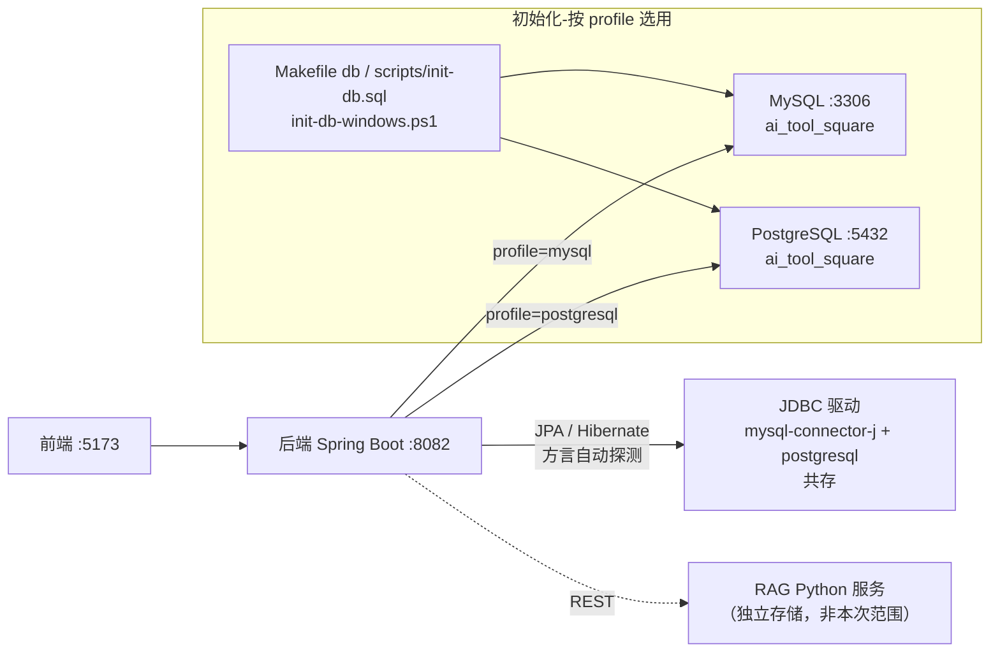
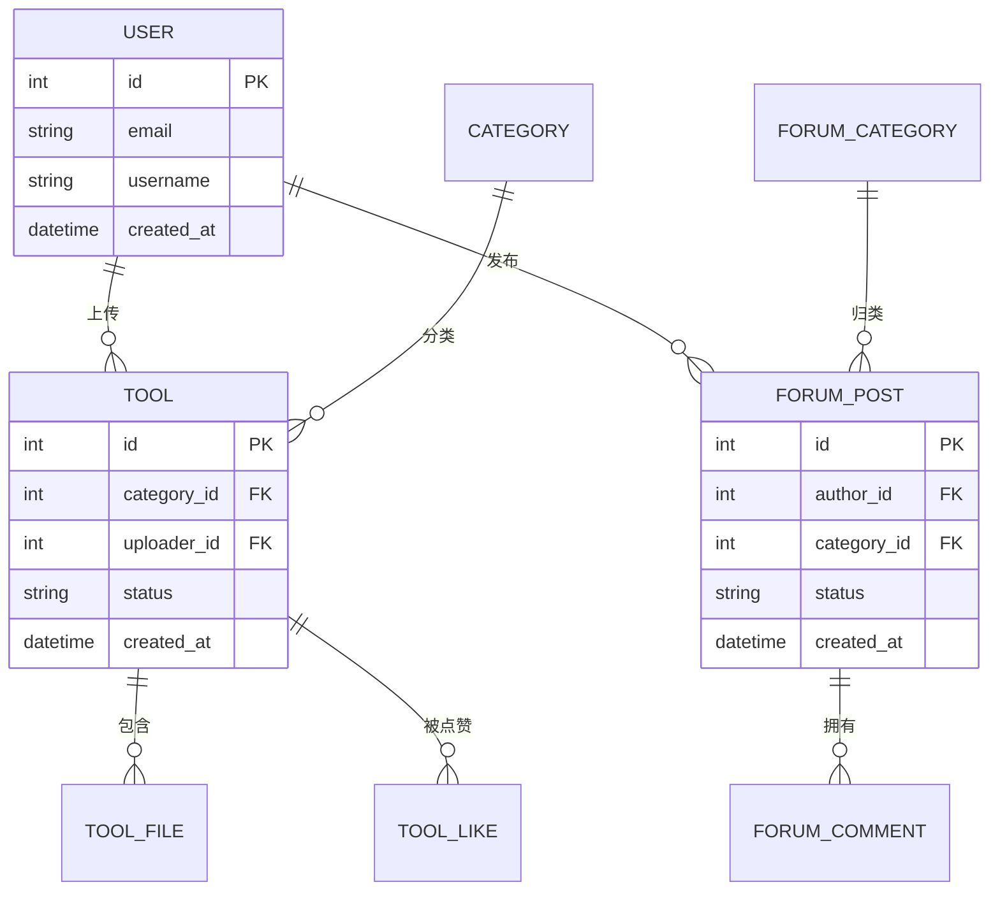

## 背景（Context）

CodingHub 后端（Spring Boot 3.2.5 + Spring Data JPA）当前以 MySQL 8.x 为唯一数据源。Wiki 与各业务模块（工具广场、论坛、知识库、统一互动、用户认证）均走「Controller → Service → Repository（JPA）」三层，持久化完全基于 JPA/Hibernate。

经探查，业务层对具体数据库几乎无强依赖：

- `nativeQuery=true` 零命中，所有查询走 JPQL/Hibernate，方言无关；
- 主键统一 `GenerationType.IDENTITY`，枚举统一 `@Enumerated(EnumType.STRING)`；
- `columnDefinition = "TEXT"` 多处（MySQL/PG 均支持）；
- 建表实际由 `ddl-auto: update` 负责，migration/初始化脚本用于手动初始化与种子。

MySQL 的强绑定点集中在：

1. `backend/build.gradle`：`runtimeOnly 'com.mysql:mysql-connector-j:8.3.0'`。
2. `backend/src/main/resources/application.yml`：JDBC URL、`driver-class-name`、`dialect: org.hibernate.dialect.MySQLDialect`。
3. `backend/src/main/java/.../model/User.java`：`@Table(name = "`user`")` 使用 MySQL 反引号引号。
4. 初始化脚本：`Makefile` 的 `db` 目标、`init-db-windows.ps1`、`scripts/init-db.sql`、`db/migration/*.sql` 的 MySQL 专有语法。

约束：`DataInitializer` 启动时写入种子数据；`ddl-auto: update` 由 Hibernate 建表，脚本主要用于手动初始化。相关方为后端开发与本地/部署运维。

## 目标 / 非目标（Goals / Non-Goals）

**目标：**
- 后端**同时兼容 MySQL 与 PostgreSQL**，通过配置（Spring Profile）选择使用哪一种，应用可正常启动并通过现有功能验证。
- 两种数据库下 Schema 由同一份实体 + `ddl-auto` 生成且均有效；字段语义、API 行为完全不变（对前端与调用方透明）。
- 业务代码零改动（仅 `User.java` 一处反引号注解需微调以跨方言）。

**非目标：**
- 不做单向"迁移"，不强依赖某一特定数据库。
- 不改变任何业务逻辑、DTO、Controller/Service 行为。
- 不引入多数据源路由 / 双写（同一时刻只连一个库）。
- 不迁移 RAG（Python）服务自身存储（独立服务，另行评估）。
- 不引入 ORM 之外的新持久化框架。
- 不强制引入 Flyway 运行时依赖（建表仍由 `ddl-auto` 负责）。

## 决策（Decisions）

**D1：双驱动共存 + Profile 切换（写法 1：单文件多文档）。**
`com.mysql:mysql-connector-j` 与 `org.postgresql:postgresql` **两者共存**于 `build.gradle`；`application.yml` 用 `---` 分为多文档，通用配置在顶部，`spring.config.activate.on-profile: mysql` 与 `postgresql` 各提供一份 `spring.datasource`。启动以 `--spring.profiles.active` 选择，非激活 profile 不加载、不绑定，两套配置共存无害。
备选：方案 B（单选择器属性 + 条件化 Bean）——否决，需额外 `@Configuration` 代码，不符合"代码层面不改"诉求。

**D2：方言自动探测，移除硬编码 `MySQLDialect`。**
Spring Boot 3.2 / Hibernate 6 在 `spring.jpa.properties.hibernate.dialect` 缺省时，会依据 JDBC 连接元数据自动解析方言（MySQLDialect / PostgreSQLDialect）。移除硬编码值后，同一份配置在两种库下都能正确建表。完全配置层解决，无需代码。

**D3：主键生成策略保持 `GenerationType.IDENTITY`。**
两库下 Hibernate 均映射为自增标识列（MySQL `AUTO_INCREMENT` / PG `GENERATED ... AS IDENTITY`），实体无需修改。

**D4：枚举维持字符串映射。**
现有 `@Enumerated(EnumType.STRING)` 天然可移植；无需改动实体，也无需 PostgreSQL 原生 `CREATE TYPE ... AS ENUM`。

**D5：`user` 保留字——全局引号策略。**
PostgreSQL 中 `user` 是保留字，`User.java` 现用 `@Table(name = "`user`")` 的 MySQL 反引号在 PG 无效。改为：
- 实体注解去反引号：`@Table(name = "user")`；
- `application.yml` 增加 `spring.jpa.properties.hibernate.globally_quoted_identifiers=true`，Hibernate 对所有标识符加引号（`"user"`），两库下均将 `user` 视为分隔标识符，无需重命名表，外键/脚本一致。
此为唯一一处实体层微调（约 1 行），非业务逻辑。

**D6：初始化脚本按库分别提供。**
`Makefile` 的 `db` 目标、`init-db-windows.ps1`、`scripts/init-db.sql` 保留 MySQL 版本，并补充 PostgreSQL 等价版本（或 PostgreSQL 侧直接依赖 `ddl-auto` 建表 + 种子）。按激活 profile 选用对应脚本。手写脚本中仍需注意的 MySQL→PG 语法映射见下表（仅用于手动脚本，运行期建表以 Hibernate 为准）：

| MySQL 写法 | PostgreSQL 写法 |
|-----------|----------------|
| `BIGINT AUTO_INCREMENT PRIMARY KEY` | `BIGINT GENERATED ALWAYS AS IDENTITY PRIMARY KEY`（或 `BIGSERIAL`）|
| `ENUM('A','B')` | `VARCHAR(20)`（+ `CHECK (col IN ('A','B'))`）|
| `... ON UPDATE CURRENT_TIMESTAMP` | 触发器维护，或依赖 JPA `@PreUpdate`（已用 `onUpdate`）|
| 表内联 `INDEX idx (...)` | 表外独立 `CREATE INDEX idx ON t (...)` |
| `ENGINE=InnoDB DEFAULT CHARSET=utf8mb4 ...` | 删除（PG 默认 UTF-8）|
| `INSERT IGNORE INTO ...` | `INSERT INTO ... ON CONFLICT DO NOTHING` |
| 反引号 `` `user` `` | 双引号 `"user"`（由 `globally_quoted_identifiers` 自动处理）|

**D7：测试数据源策略。**
`application-test.yml` 仍用 H2。因查询方言无关，两种库路径均被覆盖；将 H2 `MODE` 与默认 profile（mysql）对齐即可，无需 Testcontainers。如未来需更高保真可再评估。

## 架构图

> 同一时刻仅连一个库；Profile 决定走 MySQL 还是 PostgreSQL，业务代码无感知。

## 数据模型

> 实体关系与字段语义在双库方案下保持不变，底层类型/DDL 由 Hibernate 按激活方言生成。

## 风险 / 权衡（Risks / Trade-offs）

- [标识符大小写差异] MySQL 表/列名大小写不敏感，PostgreSQL 未加引号时折叠小写 → 全局引号策略（`globally_quoted_identifiers`）下两库均按实体原样引用，保持一致。
- [保留字 `user`] 已通过 D5 全局引号解决，无需重命名表。
- [`ddl-auto: update` 行为差异] 两库下自动建表列类型可能略有差异（如 `TEXT` vs `VARCHAR`）→ 以 Hibernate 建表为准，启动后核对 schema。
- [布尔/整型隐式转换] 已用 `BOOLEAN`，风险低。
- [LIKE 大小写敏感] PostgreSQL `LIKE` 大小写敏感，MySQL 默认不敏感 → 现有搜索 `LIKE %:keyword%` 在两库行为可能不同；如需统一不敏感，PG 侧用 `ILIKE`（列入待定，按产品需求决定，不影响双库共存能力本身）。
- [两驱动共存体积] 同时引入两个 JDBC 驱动会略微增大构建产物，但换来零业务改动与可移植性，收益大于成本。

## 切换计划（Switch Plan）

1. 准备所选数据库服务（MySQL 默认已具备；PostgreSQL 本地默认端口 5432，库名 `ai_tool_square`）。
2. `build.gradle` 同时保留 mysql-connector-j 与引入 postgresql，刷新 Gradle。
3. 重构 `application.yml` 为多文档 Profile（通用 + mysql + postgresql），移除硬编码方言，开启全局引号。
4. 微调 `User.java` 注解去反引号；补充对应库的初始化脚本。
5. 启动后端（`ddl-auto: update`）验证建表；执行对应初始化脚本注入种子数据。
6. 回归验证核心功能（登录、工具 CRUD、论坛、点赞/收藏、知识库、通知）。
7. 切换库：停止应用，以 `--spring.profiles.active=postgresql`（或 `mysql`）重启即可，无需改代码。

**回滚策略：** 默认 profile 即为 `mysql`，不指定 profile 即回退原行为；PostgreSQL 相关配置独立成段，删除 postgresql 段或移除 postgresql 依赖即可完全回退。

## 待定问题（Open Questions）

- 搜索是否需要保持大小写不敏感（`LIKE` → `ILIKE`）？该问题与双库共存能力正交，可独立决定。
- 是否在本次引入 Flyway 运行时依赖以统一管理迁移，还是继续依赖 `ddl-auto: update` + 手写脚本？
- RAG（Python）服务的存储是否需要同步评估（本次列为非目标）？
