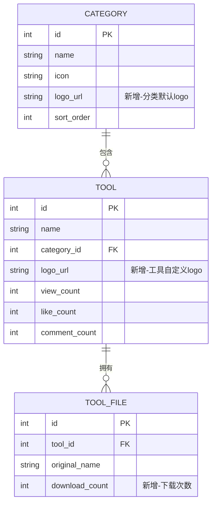
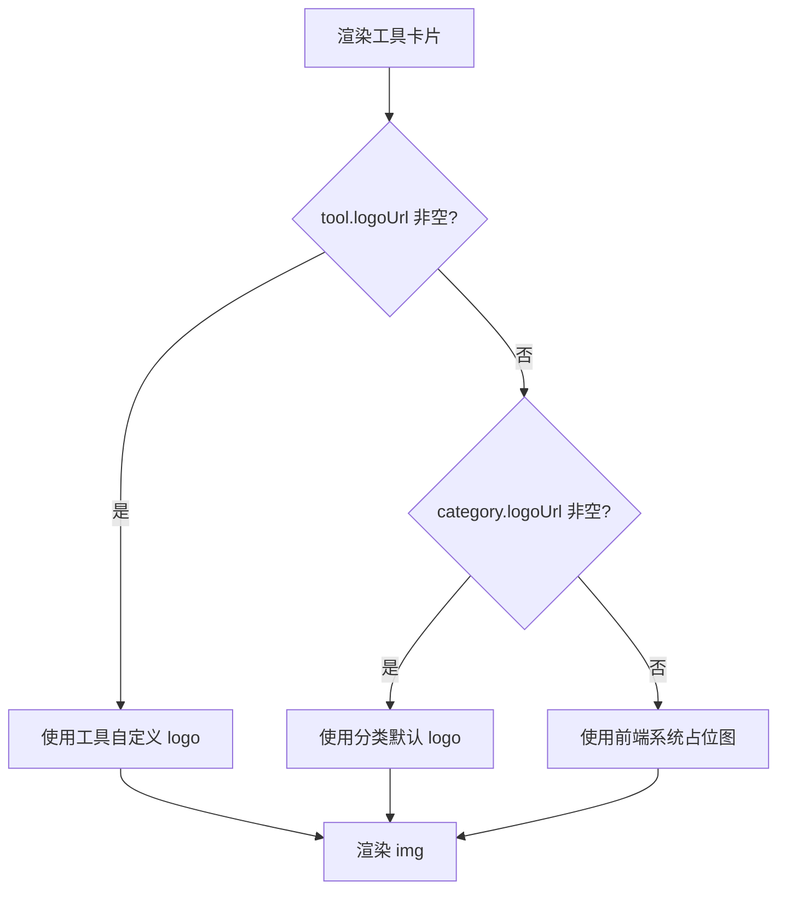
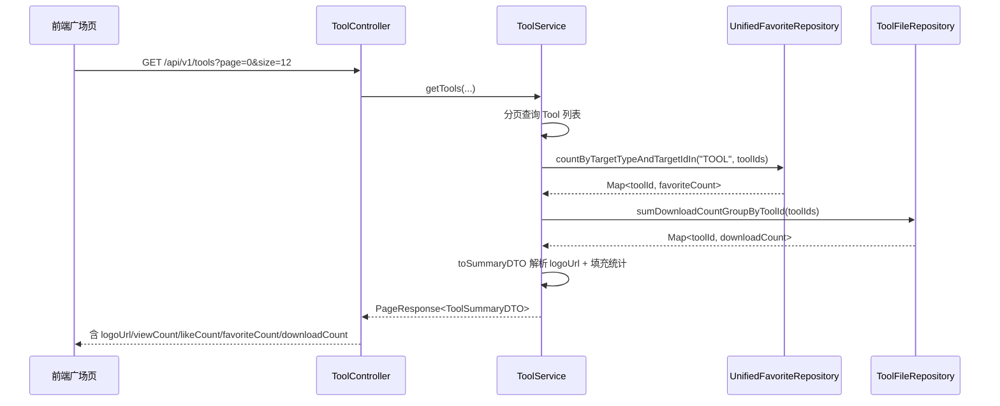

## 背景（Context）

工具广场（Tool Square）采用三层架构：`ToolController → ToolService → ToolRepository`，列表查询统一走 `ToolService.getTools(...)` 并通过私有方法 `toSummaryDTO(Tool)` 组装 `ToolSummaryDTO` 返回前端。当前现状与约束：

- **视觉缺失**：`Tool` 实体没有 logo 字段，`ToolSummaryDTO` 仅携带 `categoryIcon`（emoji 字符串），前端所有卡片渲染统一占位图标。
- **统计字段不全**：`Tool` 实体已有 `viewCount` / `likeCount` / `commentCount` / `score`，但缺少**收藏量**与**下载量**。收藏由统一互动模块 `unified_favorite` 表管理（`targetType='TOOL'`），下载行为发生在 `ToolFileService.downloadFile(...)`，但 `tool_file` 表无下载计数字段。
- **图片上传已具备**：`ImageUploadController`（`POST /api/v1/uploads/images`）已实现通用图片上传，存储于 `{baseDir}/images/{uuid}.ext`，返回相对 URL `/api/v1/uploads/images/{filename}`，GET 公开访问、POST 需认证。头像、论坛帖子图片均复用此端点。
- **历史决策约束**（来自 LLM Wiki）：评论 / 收藏 / 点赞必须**复用统一互动实现**，禁止重复造轮子——因此收藏量必须从 `unified_favorite` 聚合，不得新建 tool_favorite 表。
- **DDL 管理**：Schema 由 `ddl-auto:update` 管理（不使用 Flyway 新增脚本），新增列由 JPA 自动建表。

相关方：工具上传者（上传 / 设置 logo）、超级管理员（配置分类默认 logo）、广场访客（浏览卡片统计）。

## 目标 / 非目标（Goals / Non-Goals）

**目标：**

- 工具支持自定义 logo，未设置时按「工具 logo → 分类默认 logo → 系统占位图」三级回退，前端拿到的是已解析的最终 URL。
- 分类支持配置默认 logo（`category.logo_url`），管理端可修改。
- 工具卡片底部展示浏览量、点赞量、收藏量、下载量四项统计，配图标与格式化数字（1.2k / 16.5 万）。
- 收藏量复用 `unified_favorite` 聚合，下载量通过 `tool_file.download_count` 累加聚合，二者均按 `toolId` 批量查询避免 N+1。
- 所有 API 变更向后兼容（仅新增字段，不改动既有字段语义）。

**非目标：**

- 不实现 logo 图片的在线裁剪 / 编辑（仅上传与选择）。
- 不引入对象存储 / CDN（沿用本地 `~/.aifiles/images/` 磁盘存储）。
- 不为下载行为做防刷 / 限流（与现有 downloadFile 行为一致）。
- 不改动统一互动模块的收藏 / 点赞写入逻辑（只读取聚合计数）。
- 不实现评论量在卡片上的展示（卡片仅四项统计，评论量已有字段但本次不上卡片）。

## 决策（Decisions）

### 决策 1：logo 存储复用通用图片上传端点，而非新建独立存储

- **选择**：logo 文件复用 `POST /api/v1/uploads/images`（`ImageUploadController`）上传，`tool.logo_url` / `category.logo_url` 仅保存返回的相对 URL 字符串。
- **备选**：新建 `POST /api/v1/tools/{id}/logo` 直接接收 multipart 并落盘。
- **理由**：图片上传、扩展名校验、UUID 命名、路径穿越防护、GET 公开访问已在 `ImageUploadController` 中实现并被头像 / 帖子图片复用；新建独立存储是重复造轮子。新增一个**轻量绑定端点** `POST /api/v1/tools/{id}/logo`（body: `{"logoUrl": "..."}`）负责鉴权（owner/admin）与写库，上传与绑定解耦。

### 决策 2：logo 回退链在后端解析，前端只拿最终 URL

- **选择**：`ToolService.toSummaryDTO` / `toDetailDTO` 中计算 `logoUrl = tool.logoUrl ?? tool.category.logoUrl`（二者皆空时返回 `null`），前端在 `null` 时渲染本地系统占位图。
- **备选**：DTO 同时返回 `toolLogoUrl` + `categoryLogoUrl`，由前端做回退。
- **理由**：回退逻辑集中在一处，避免 Web 卡片、详情页、MCP 输出等多端重复实现；系统占位图作为前端静态资源（随主题切换），无需入库。分类默认 logo 入库（`category.logo_url`）满足「默认 logo 地址保存在 category 表」的需求。

### 决策 3：收藏量从 unified_favorite 聚合，下载量从 tool_file 累加

- **选择**：
  - 收藏量：`UnifiedFavoriteRepository.countByTargetTypeAndTargetId("TOOL", toolId)`。
  - 下载量：`tool_file` 新增 `download_count` 列，`ToolFileService.downloadFile` 每次成功下载 `+1`；`ToolFileRepository.sumDownloadCountByToolId(toolId)` 聚合工具总下载量。
- **备选**：在 `tool` 表冗余 `favorite_count` / `download_count` 字段，写入时同步维护。
- **理由**：收藏的权威数据源是 `unified_favorite`（Wiki 明确要求复用），冗余字段会引入双写一致性风险。下载量没有现成计数，`tool_file.download_count` 是最小侵入的可靠来源（每次下载原子自增）。列表页通过批量 `IN` 查询（`countByTargetTypeAndTargetIdIn` / `sumDownloadCountGroupByToolId`）组装 Map，避免每卡片两次查询的 N+1。

### 决策 4：统计计数批量加载，注入新仓库不破坏现有构造器

- **选择**：`ToolService` 通过 `@RequiredArgsConstructor` 追加注入 `UnifiedFavoriteRepository` 与 `ToolFileRepository`；`getTools` / `getMyTools` 在拿到当前页 `toolIds` 后一次性批量查询两个 Map，再传入映射方法。
- **理由**：现有 `toSummaryDTO(Tool)` 在分页流中逐个调用，逐条查询收藏 / 下载会产生 2×pageSize 次额外 SQL。批量查询将开销压到每页 2 次。注意既有测试以位置参数构造 `ToolService`（见 MEMORY：构造器顺序），新增依赖须同步更新测试构造调用。

### 决策 5：数字格式化在前端统一实现

- **选择**：前端新增 `formatCount(n)` 工具函数：`n >= 10000` → `(n/10000).toFixed(1) + '万'`（去尾零）；`n >= 1000` → `(n/1000).toFixed(1) + 'k'`；否则原值。
- **理由**：格式化是纯展示逻辑，后端返回原始整数，便于排序 / 比较；参考 SkillHub 的「16.5 万」「207」展示风格。

## 数据模型

## 流程图

> 回退判断在 `ToolService.toSummaryDTO` 完成（C/E 分支），前端仅在 DTO `logoUrl == null` 时走 F 分支。

## 时序图

## 风险 / 权衡（Risks / Trade-offs）

- **[N+1 查询风险]** 逐卡片查询收藏 / 下载会拖慢列表 → 用 `IN` 批量查询组装 Map，每页固定 2 次聚合 SQL。
- **[构造器变更破坏既有测试]** `ToolService` 追加依赖会改变位置参数构造顺序 → 同步更新 `ToolServiceTagFilterTest` 等以位置参数构造的测试，新增依赖放在构造器末尾。
- **[下载计数并发自增]** 高并发下载下 `download_count++` 可能丢失更新 → 用 `@Modifying @Query("UPDATE ToolFile f SET f.downloadCount = f.downloadCount + 1 WHERE f.id = :id")` 原子自增，避免读改写竞态。
- **[logo URL 失效]** 图片文件被清理或路径变更导致卡片裂图 → 前端 `img` 加 `@error` 兜底回退到系统占位图。
- **[向后兼容]** 既有 API 消费方（MCP / 旧前端）不识别新字段 → 仅新增字段、不改既有字段，旧消费方忽略即可。

## 迁移计划（Migration Plan）

- DDL 由 `ddl-auto:update` 自动添加 `tool.logo_url`、`category.logo_url`、`tool_file.download_count` 三列，存量行新列为 `NULL` / 默认 `0`，无需数据回填。
- 存量工具 `logoUrl` 解析为 `null`，前端自动回退到分类默认 logo / 系统占位图，零数据迁移即平滑上线。
- 回滚：删除新增列即可，前端对缺失字段已有占位兜底。

## 待定问题（Open Questions）

- 分类默认 logo 是否需要在本次提供管理端可视化上传入口，还是先通过分类更新接口（`PUT /api/v1/categories/{id}` 携带 `logoUrl`）由管理员设置？倾向后者以缩小前端改动面，待实现阶段确认管理端分类页现状。
