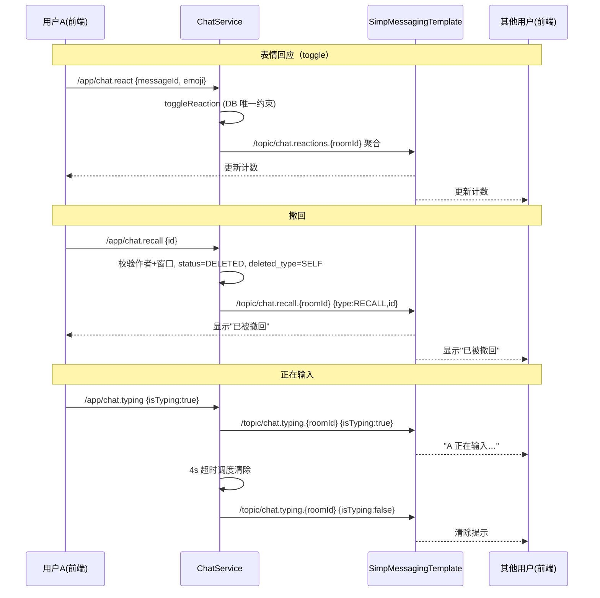
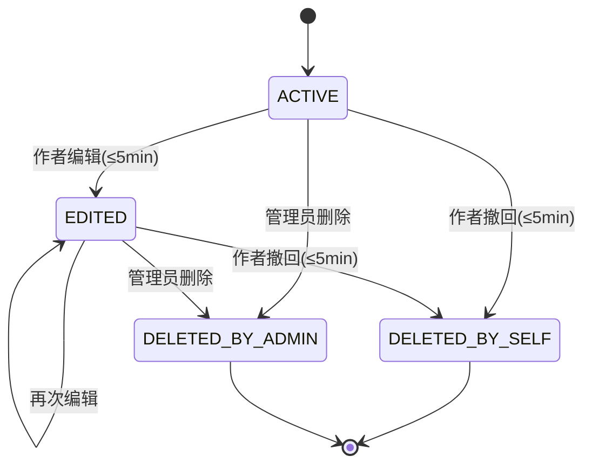
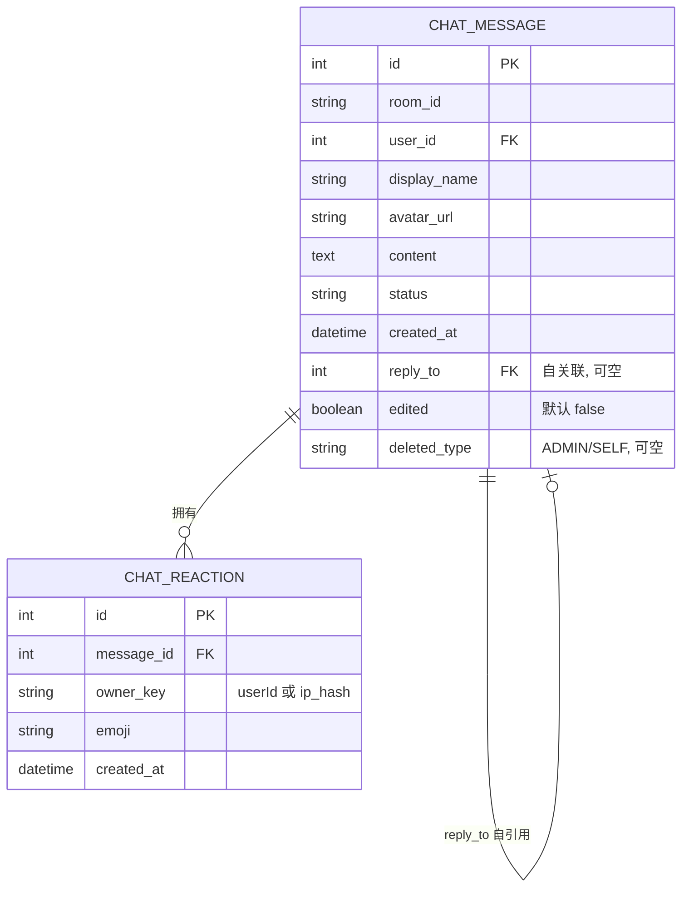

## 背景（Context）

聊天室 MVP（`chat-room`，已归档）提供了：`/app/chat.send` 发送、`/topic/chat.{roomId}` 广播、`/topic/chat.presence` 在线人数、`GET /api/v1/chat/messages` 历史、管理员 `DELETE /api/v1/chat/messages/{id}` 软删除（`status=DELETED`），以及服务端 `XssSanitizer` 净化。WebSocket 使用 Spring STOMP + SimpleBroker（无外部消息中间件）。

P1 在此基础上新增六项交互增强（见 `spec.md`）。核心约束：

- 双数据库（MySQL 8 / PostgreSQL）通过 Flyway 迁移 + Hibernate 自动方言共存，新表/新列必须双库兼容。
- 沿用 MVP 的游客/登录双模式（`ChatPrincipal` 携带 `userId` 或 `ipHash` + `displayName`）。
- 实时通信仍走 STOMP SimpleBroker，不引入 RabbitMQ。
- XSS 必须在服务端入库前净化（已有），前端 Markdown 渲染需再做一层安全渲染兜底。

## 目标 / 非目标（Goals / Non-Goals）

**目标：**

- 在 MVP 协议/数据模型之上，以最小侵入方式实现 typing / reactions / reply / markdown / edit / recall 六项能力。
- 保持游客与登录用户两种身份模型一致（reactions 用 `owner_key` 统一标识，edit/recall 仅作者可用）。
- 区分「作者撤回」与「管理员删除」的语义与展示。

**非目标：**

- 不实现消息线程化/嵌套回复（仅单层引用）。
- 不实现端到端加密、消息已读回执、富媒体（图片/文件）上传。
- 不引入消息中间件或独立的 reaction 服务进程。
- 不实现跨房间消息聚合/搜索。

## 决策（Decisions）

**D1 · WebSocket 通道与目的地约定**

沿用 MVP 风格，新增客户端发往服务端的 `@MessageMapping` 目的地与广播 `topic`：

| 方向 | 目的地 | 说明 |
|------|--------|------|
| 入站 | `/app/chat.typing` | 发送 typing 状态 |
| 入站 | `/app/chat.react` | 添加/取消 emoji 回应 |
| 入站 | `/app/chat.edit` | 编辑自己的消息 |
| 入站 | `/app/chat.recall` | 撤回自己的消息 |
| 广播 | `/topic/chat.typing.{roomId}` | 正在输入状态 |
| 广播 | `/topic/chat.reactions.{roomId}` | 某消息 reaction 聚合更新 |
| 广播 | `/topic/chat.edit.{roomId}` | 编辑后消息 DTO |
| 广播 | `/topic/chat.recall.{roomId}` | 撤回事件（type=RECALL） |

> MVP 的 `/app/chat.send` 与 `/topic/chat.{roomId}` 保持不变；edit/recall 走独立 topic 以解耦信封结构，避免污染既有消息流。

**D2 · Typing 节流与超时**

- 前端：输入事件经节流（≥1s）才发送 `isTyping:true`；发送消息或失焦时立即发送 `isTyping:false`。
- 服务端：维护 `ConcurrentHashMap<String, ScheduledFuture>`（`key = roomId:userId`），每次收到 `isTyping:true` 时取消旧任务并重新调度一个 4s 后的清除任务；收到 `isTyping:false` 时取消任务并立即广播清除。不持久化。

**D3 · Reactions 数据模型与 toggle**

- 新增 `chat_reaction` 表：`id, message_id, owner_key, emoji, created_at`。
  - `owner_key`：登录用户存 userId 字符串，游客存 `ip_hash`。**统一唯一约束 `(message_id, owner_key, emoji)`**，避免登录/游客两套索引，双库兼容。
- 服务层 `toggleReaction(messageId, ownerKey, emoji)`：存在则删、不存在则增；在 `@Transactional` 内重新聚合该消息 `Map<emoji,count>` 后广播。
- 历史接口与广播消息附带 `reactions` 聚合 + `myReactions`（依当前 `userId` 或 `ip_hash` 计算）。

**D4 · Reply 自关联**

- `ChatMessage.replyTo`：`@ManyToOne` 自引用 `@JoinColumn(name="reply_to")`，可空。
- 引用摘要（`replyToDisplayName`、`replyToContentPreview` 截断 80 字）在 `toDTO` 时一并组装，避免前端二次拉取。
- 被引消息已删除时，前端据 `replyTo` 查不到对应消息或 `status=DELETED` → 渲染「原消息已删除/已撤回」占位。

**D5 · Markdown 渲染与安全**

- 服务端：入站仍走 `XssSanitizer.sanitize`（MVP 已有），存储净化后文本。
- 前端新增依赖 `marked`（解析）+ `dompurify`（净化，禁止原始 HTML 注入）+ `highlight.js`（代码块高亮）。
- 渲染策略：先用 DOMPurify 净化文本 → `marked.parse` → 代码块包裹 highlight.js；渲染输出受控（v-html 仅接受已净化内容），`prefers-reduced-motion` 下关闭高亮动画。

**D6 · 编辑 / 撤回窗口**

- 常量 `EDIT_WINDOW_MS = 300_000`（5 分钟）、`RECALL_WINDOW_MS = 300_000`（5 分钟），依 `createdAt` 计算。
- 仅作者可用：登录用户 `userId` 匹配，或游客 `ipHash + displayName` 匹配。
- 游客撤回属已知弱校验（无法可靠防冒名），列为风险（见 R1）。

**D7 · 撤回 / 删除类型区分**

- `ChatMessage` 新增 `deleted_type` 枚举列（`ADMIN` / `SELF`），可空。
- MVP 既有 `softDelete` 改为置 `deleted_type=ADMIN`；P1 recall 置 `deleted_type=SELF`。
- 广播信封：`RECALL`（type=RECALL）vs `DELETE`（type=DELETE）区分；`ChatEventDTO` 增加 `deletedType` 字段。
- 向后兼容：存量 `status=DELETED` 且 `deleted_type=null` 的行，前端/服务端一律按 `ADMIN` 解释。

**D8 · DTO 扩展**

- `ChatMessageDTO` 新增：`replyTo(Long)`、`replyToDisplayName(String)`、`replyToContentPreview(String)`、`edited(boolean)`、`deletedType(String)`、`reactions(Map<String,Integer>)`、`myReactions(List<String>)`。
- 新增 DTO：`ChatReactionDTO(emoji, count, reactedByMe)`、`TypingEventDTO(roomId, userId, displayName, isTyping)`、`ReactionActionPayload(messageId, emoji)`、`EditPayload(id, content)`、`RecallPayload(id)`。

## 架构图

```mermaid
flowchart TD
    FE["前端 ChatRoom / 子组件"] -->|STOMP /app/chat.send| WS["ChatWsController"]
    FE -->|/app/chat.typing| WS
    FE -->|/app/chat.react| WS
    FE -->|/app/chat.edit| WS
    FE -->|/app/chat.recall| WS
    WS --> SVC["ChatService (扩展)"]
    SVC --> REPO["ChatMessageRepository"]
    SVC --> RREPO["ChatReactionRepository (新增)"]
    SVC --> MSG["SimpMessagingTemplate"]
    MSG -->|/topic/chat.{roomId}| FE
    MSG -->|/topic/chat.typing.{roomId}| FE
    MSG -->|/topic/chat.reactions.{roomId}| FE
    MSG -->|/topic/chat.edit.{roomId}| FE
    MSG -->|/topic/chat.recall.{roomId}| FE
    SVC --> DB[("chat_message + chat_reaction")]
```

## 时序图



## 状态图



## 数据模型



新增列与表（双库兼容要点）：

- `chat_message`：`reply_to BIGINT NULL`、`edited TINYINT(1) NOT NULL DEFAULT 0`、`deleted_type VARCHAR(10) NULL`。
- `chat_reaction`：`id BIGINT PK`、`message_id BIGINT NOT NULL`、`owner_key VARCHAR(64) NOT NULL`、`emoji VARCHAR(16) NOT NULL`、`created_at DATETIME NOT NULL`；唯一索引 `uk_reaction (message_id, owner_key, emoji)` + 外键 `fk_reaction_message`。
- Flyway 迁移脚本放 `backend/src/main/resources/db/migration/`，编号延续 V1~V9（如 `V10__chat_room_p1.sql`），使用兼容双库的 DDL（避免数据库专有类型）。

## 风险 / 权衡（Risks / Trade-offs）

- **R1 游客撤回冒名**：游客以 `ip_hash + displayName` 校验作者身份，攻击者伪造同网段 IP/昵称可撤回他人消息 → 缓解：游客撤回仅在相对短窗口内允许，且前端对游客隐藏「撤回/编辑」入口（或仅允许本人会话内），后续可在 P2 引入临时签名 token。
- **R2 typing 广播风暴**：高并发房间频繁 typing 推送 → 缓解：前端 1s 节流 + 服务端 4s 超时去抖，仅广播状态跳变。
- **R3 Markdown 渲染 XSS**：前端 `v-html` 若直接渲染未净化内容有注入风险 → 缓解：DOMPurify 强制净化 + marked 禁用原始 HTML。
- **R4 双库迁移差异**：MySQL/PostgreSQL 类型/函数差异 → 缓解：迁移脚本仅用标准 SQL 与兼容类型，Hibernate `ddl-auto: update` 作为兜底。
- **R5 历史接口体积**：reactions 聚合随每条消息返回，长历史列表体积增大 → 缓解：`myReactions` 仅在登录时计算，emoji 集合按需裁剪。

## 迁移计划（Migration Plan）

1. 新增 Flyway 迁移 `V10__chat_room_p1.sql`：加列 `chat_message` + 建表 `chat_reaction` + 索引/外键；双库各一版（或单文件兼容）。
2. 后端部署后，`ddl-auto: update` 兜底校验结构一致。
3. 前端发布含 `marked/dompurify/highlight.js` 的新包，`make frontend` 重装依赖。
4. 回滚：保留迁移 `V10` 的下线脚本（删除列/表前确认无在线连接）；前端回滚至 MVP 版本即可，P1 字段对 MVP 后端向后兼容（新增列均有默认值/可空）。

## 待定问题（Open Questions）

- 游客是否在前端暴露「编辑/撤回」入口？（倾向隐藏，待产品确认）
- emoji 集合是否限制为固定面板（如 8 个常用 emoji）还是开放任意 unicode？（倾向固定面板以控存储）
- 编辑/撤回窗口 5 分钟是否需可配置（放入 `application.yml`）？（倾向常量 + 后续配置化）
