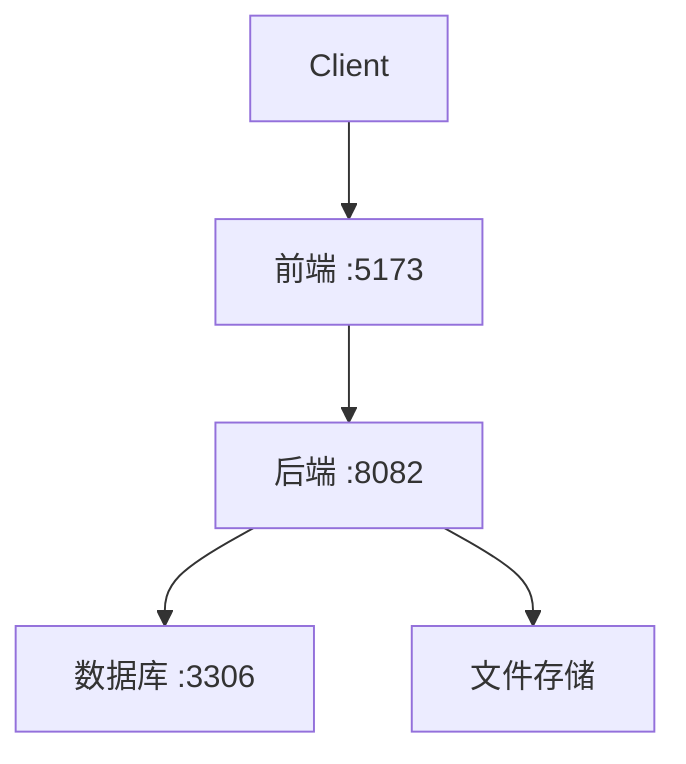
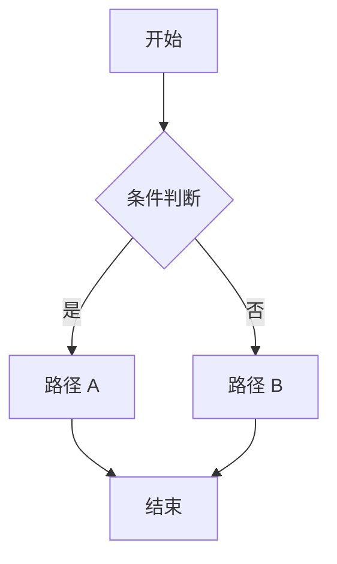
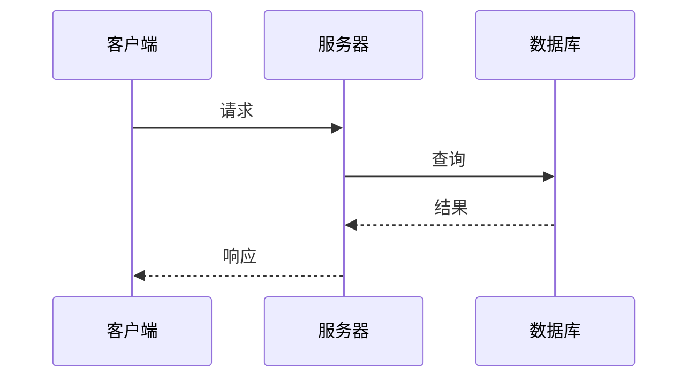
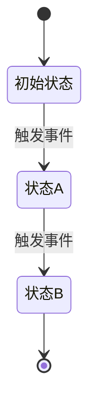
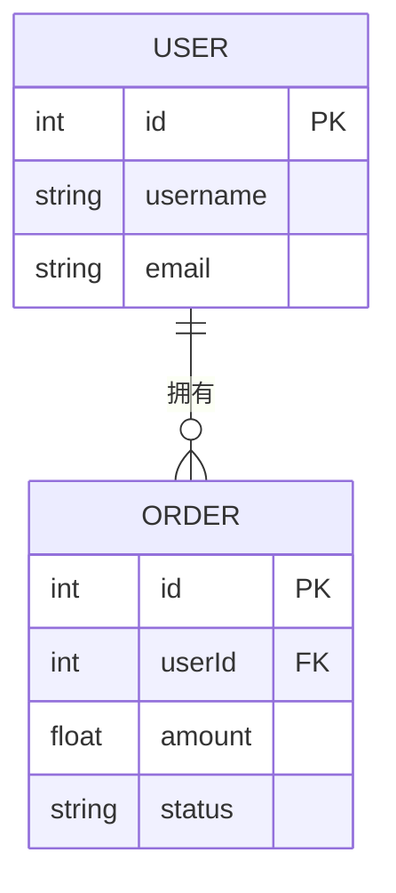

## 背景（Context）

<!-- 背景与现状、约束条件、相关方 -->

## 目标 / 非目标（Goals / Non-Goals）

**目标：**
<!-- 本设计要达成的目标 -->

**非目标：**
<!-- 明确排除的范围 -->

## 决策（Decisions）

<!-- 关键设计决策及理由（为何选 X 而非 Y？列出备选方案） -->

## 架构图

<!-- 【条件生成】当变更涉及多个模块/服务、引入新架构模式或改变系统拓扑时使用 -->
<!-- 使用 flowchart 展示模块间依赖关系和数据流向 -->

## 流程图

<!-- 【条件生成】当涉及复杂业务流程、审批链路、算法逻辑时使用 -->
<!-- 使用 flowchart TD（上下）或 LR（左右），用 {菱形} 表示判断节点 -->

## 时序图

<!-- 【条件生成】当涉及多系统交互、API 调用链路、消息流转时使用 -->
<!-- 使用 participant 定义参与者，->> 请求，-->> 响应 -->

## 状态图

<!-- 【条件生成】当涉及对象状态变迁（订单、审批、工单等）时使用 -->
<!-- [*] 表示初始/终止状态，--> 上的文本是触发事件 -->

## 数据模型

<!-- 【条件生成】当涉及数据库表结构变更、实体关系变更时使用 -->
<!-- GitHub Mermaid ER 图仅支持标准类型：int, string, float, boolean, date, datetime -->
<!-- 禁止使用 bigint, text, decimal, long 等非标准类型，否则 GitHub 无法渲染 -->

## 风险 / 权衡（Risks / Trade-offs）

<!-- 已知风险和权衡。格式：[风险] → 缓解措施 -->

## 迁移计划（Migration Plan）

<!-- 【可选】部署步骤、回滚策略（如涉及数据迁移或部署变更） -->

## 待定问题（Open Questions）

<!-- 待决策或未知事项 -->
